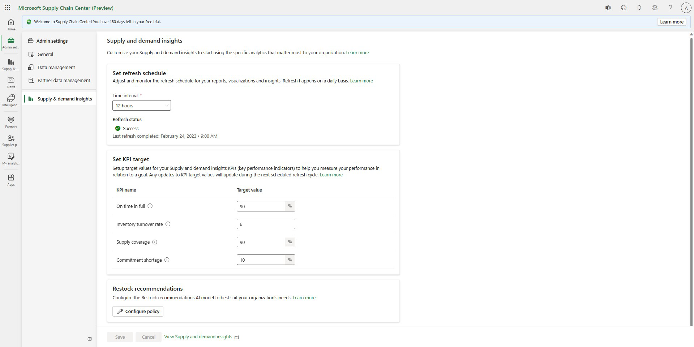
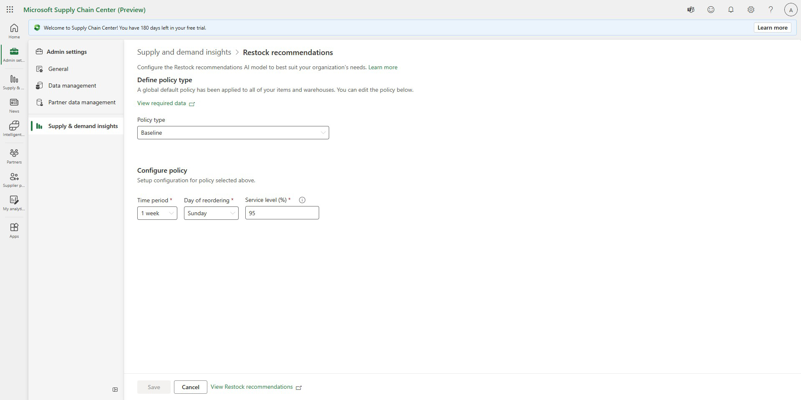

# Admin settings

Admin settings are used to control important features, such as user management, data management, and enabled modules. To access the admin settings, select the gear symbol in the upper-right corner, and then select **Admin settings**. In **Admin Settings**, there are three categories of settings: **General**, **Data management**, and **Supply & demand insights**.

## General

In the **General** section, users can view instructions for managing users and sample data. To manage users, see [Add users](add-users.md).

### Removing data

Your environment includes preloaded sample data so that you can experience Microsoft Supply Chain Center’s features. However, you can also import your own data in addition to this sample data. To clear out the sample data, select **Remove data**. Selecting this button will:

- Delete all preloaded sample data.
- Delete all data that was uploaded in addition to the preloaded sample data.

Removal of your data can take a few moments. Until it's completed, some modules might not be accurate. You will be notified, via an in-app notification, when your data has been removed.

## Data management

To manage your company’s data or data that you want to ingest on behalf of a partner organization (supplier or customer), see the [data upload documentation](ingest-data.md). To request data from your supplier via the Supplier Portal feature, see the [Supplier Portal documentation.](../use/supplier-portal.md)

## Supply & demand insights

The **Supply & demand insights** section contains a **Setup** page and an **Restock recommendations** page that you can use to customize settings for the Supply & demand insights module.

### Setup

On the **Setup** page, you can set the time interval to specify how frequently you want the analytics for the Supply & demand insights module to be updated based on the data you imported. The analytics can be updated every 3, 6, 12, or 24 hours depending on which option is selected in the dropdown. A status below the dropdown will show when the data was last refreshed and when it will be refreshed next.

The page also contains a status indicator that tells you when the analytics were last updated. On the **Setup** page, you can also set target values from 0 through100 percent to measure performance against for the following supply chain key performance indicators (KPIs):

- **Supply Coverage**: Supply Coverage is the measure of supply that meets demand and is expressed as a percentage. It shows whether the inventory that is on hand and the expected supply that is in transit for that period meet the demand for that period. The higher the percentage, the better the coverage is. Lower coverage indicates a supply shortfall and potential risk to meeting demand.
- **Inventory Turnover Rate**: Inventory Turnover Rate is the measure of the number of times that goods are turned over relative to their consumption. In other words, it's a measure, by company, of the number of days that is required to consume an item that was procured. Inventory turnover is indicative of the financial and investment health of a company.
- **On Time in Full**: On Time in Full (OTIF) is the measure of a supplier’s ability to fulfill an order in full and deliver it on time per the originally requested delivery date. OTIF is a key supply chain metric to measure a supplier’s performance. It's sometimes referred to as Perfect Order.
- **Commitment Shortage**: Commitment Shortage is the measure of a supplier’s forecast commitments and its ability to meet those commitments. In other words, it's the measure of the original promise versus the actual delivery. This measure is indicative of a supplier’s ability to fulfill its commitment and is an important measure for evaluating a supplier’s reliability. A low number indicates good performance, and a high number indicates an unreliable supplier.

To learn more about the supply chain KPIs, see the [Supply & demand insights module overview documentation](../use/supply-and-demand.md).

### Restock recommendations

The **Restock recommendations** page lets users configure settings that affect the recommendations about when and how much inventory to order for a specific product at a specific location. You should configure the settings if you have a target service level that you want to meet, or if you have cost information that will be used to recommend the optimal target service level. To learn more about these settings, see [Configure and review restock recommendations](../use/restock-recommendations.md).

