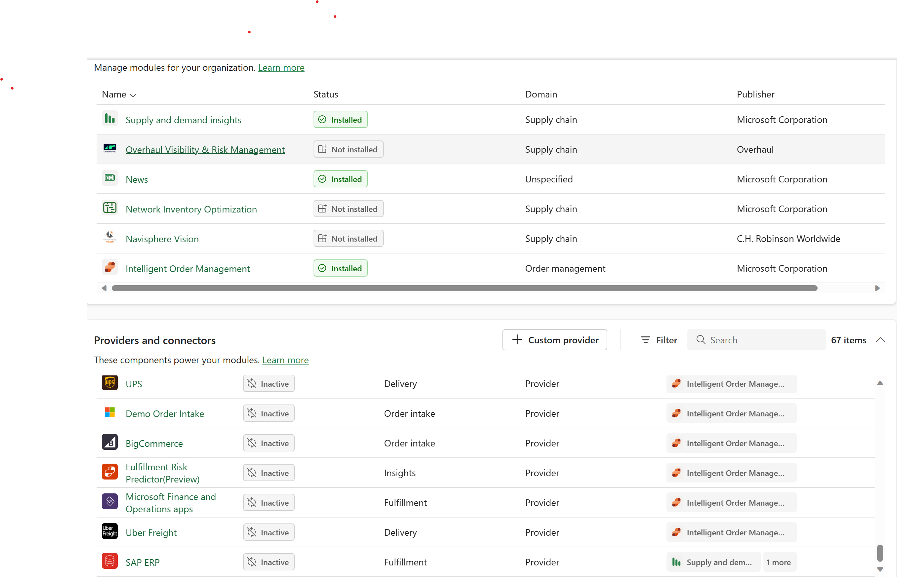
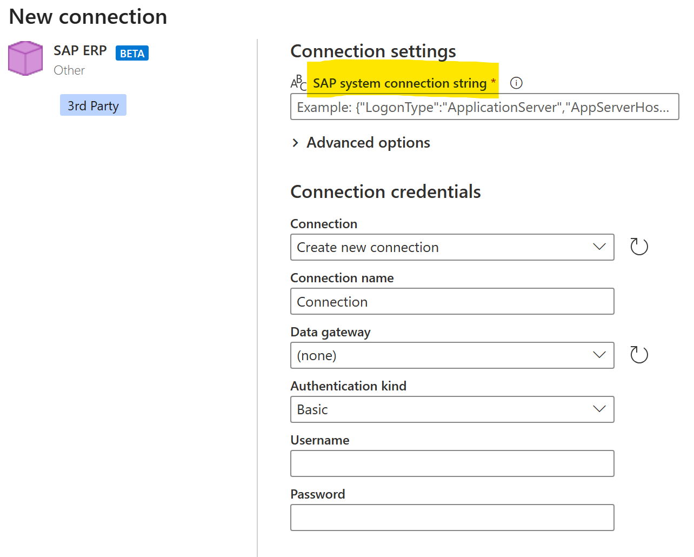
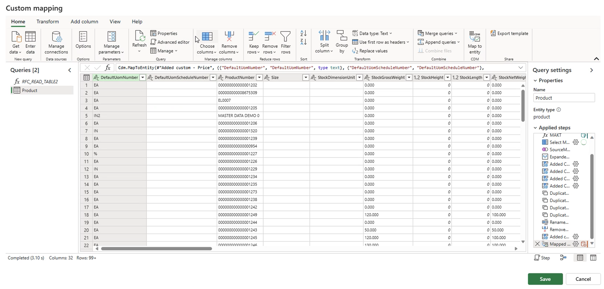
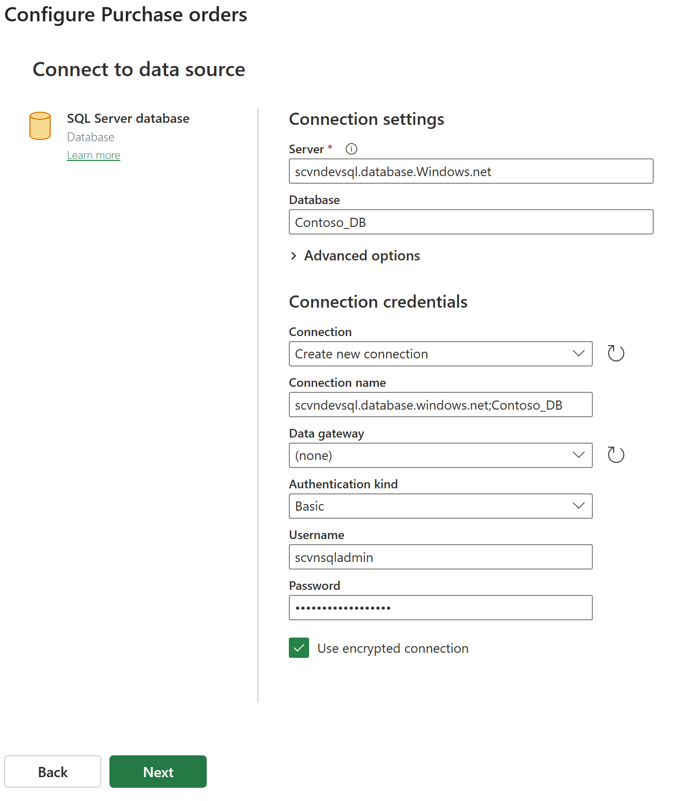
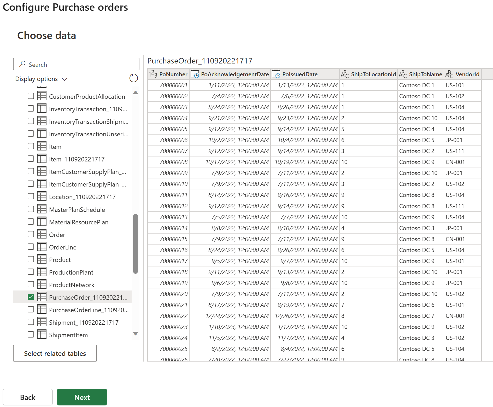
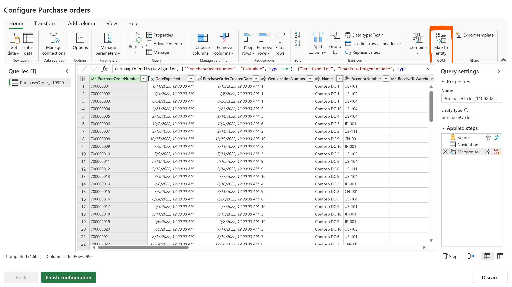

# **App Management**

App management in supply chain center is the process of overseeing the lifecycle of data ingestion. It includes two main categories of data ingestion through the concept of providers or connectors. Providers and Connectors is one of the key functionalities. It's composed on two main systems, Power Automate Flows (Transactional) and Power Platform Dataflows (Analytical scenarios). 

Providers provide default data mapping and transformation functionalities enabling simple click features for data ingestion. Users will have the convenience to accept these default mappings or edit or modify the mappings to suit their requirements.

Connectors

Transactional providers are enabled in supply chain center for Intelligent Order Management also known as IOM. There are out of the box transactional providers like SAP ERP, UPS, Flexe, Shipstation, FedEx, Orderful, Avalara, Amazon, Narvar, Uber Freight, Big commerce etc. 

Analytical providers are enabled in supply chain center for lighting up out of the box capabilities like Supply Demand Insights (SDI) or Calculation table or KPI features. Currently SAP ERP is the out of the box provider.

## **Provider**

Providers provide default data mapping and transformation functionalities enabling simple click features for data ingestion. Users will have the convenience to accept these default mappings or edit or modify the mappings to suit their requirements. 

### **How to create new instance of provider in supply chain center**

Users can search for available providers by typing the provider name in the search bar in providers and connectors page. Users can also click on "Type" column to sort by providers or connectors. The example below is a step by step process to enable **SAP ERP** provider in supply chain center. The steps remain the same for any of the out of the box providers.

When the user hovers over the provider name there are two options available for the user to open the provider or create a new instance. The plus sign is for creating new instance of the provider. Click on new instance to create a new instance of **SAP ERP** provider. 

User has a choice to choose the module for which the SAP ERP provider instance is created. The user can choose one of those options as shown in screenshot below.

Click on the next button on the bottom left of the page. Accept the terms and conditions to proceed. Click next to proceed to the next page of the provider wizard. The next option is the connection. In this page the user will connect to SAP ERP system.

As shown in the screenshot above, click on New connection to establish connection between SAP ERP and Supply chain center. 
The SAP ERP connection requires the SAP connection string and login credentials. 

When entering the details, SAP system connection string, Data gateway, Username and Password are mandatory when creating the connection. Below you will find an example of SAP connection string.

{"AppServerHost": "sap.xxxxxx.com", "Client": "XXX", "SystemNumber": "XX", "LogonType": "ApplicationServer"}

Click on Save to establish connection with SAP. On the next page click "Next" to proceed.

The next page shows the list of entities available to be mapped from SAP to MSCC. The active or inactive under Sync columns represents if those entities need to be synchronized or not. User can turn on or off the sync for each entity. The mapping for each of these entities are auto populated and the user can choose to change those mappings by clicking on the pencil icon. See screenshot below.

On the next page, users can click on the advance editor on menu bar on the top and modify the mappings as required.

On the next page click on refresh settings to setup the frequency of data ingestion. Users have the option to either setup manual refresh or setup automatic refresh at regular intervals. See screenshot below. If setting up automatic refresh, users can setup every minute refresh or hour or days etc.

Click on the finish setup to complete setting up SAP ERP provider.

   

## **Connector**

Power query connectors are Microsoft’s Data Connectivity and Data Preparation technology that lets you seamlessly access data stored in hundreds of sources and reshape it to fit your needs—all with an easy to use, engaging, no-code experience. For more information on connectors please check this link https://learn.microsoft.com/en-us/power-query/

In Supply chain center users can use the connectors experience to create instances of data flow. 

### **How to create new instance of connector in supply chain center**

In the below example a connector instance will be created for SQL Server database. Users can search for available connectors by typing the connector name in the search bar in providers and connectors page. Users can also click on "Type" column to sort by providers or connectors. The example below is a step by step process to enable connector experience in supply chain center using SQL Server database connector. The steps remain the same for any of the out of the box connectors.

Choose SQL Server database and click on plus icon to create a new instance.

Click on the next button on the bottom left of the page. The next page offers the user to choose ingestion based on scenario. User can choose the scenario and click next to proceed. 

After selecting the scenario, click next to proceed to the next page which displays all entities that are required or optional for the scenario. Choose all entities or selected entities for ingestion.

Select the tables or entities as shown above and click next to proceed. The next page is the begin of configuring connectivity to the selected entities, see screenshot below. Click on edit to begin establishing connection with the source.

After clicking edit the next page depends upon the type of connector the user chose. In this example we chose SQL Server database and hence the connector requests server, database and user credentials for authentication. See screenshot below.

Click next to connect to the source. Choose the source entity as shown in screenshot below and click next to proceed.

On the next page click on **"Map to entity"** on the top right corner as shown in screenshot below. Click on finish configuration to complete mapping source data to destination data.

On the next page click on refresh settings to setup the frequency of data ingestion. Users have the option to either setup manual refresh or setup automatic refresh at regular intervals. See screenshot below. If setting up automatic refresh, users can setup every minute refresh or hour or days etc.

Click **Save** to save the connector.
