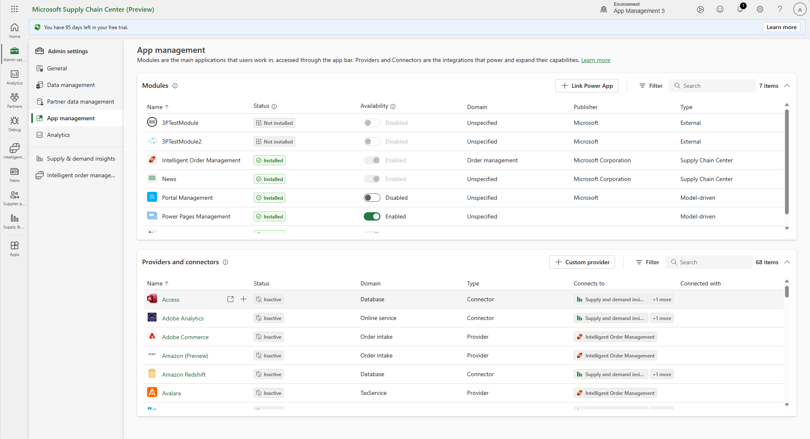

# App management

Companies can customize Supply Chain Center to meet their unique business requirements and goals by connecting various first and third party supply chain applications. Supply Chain Center provides administrators an easy-to-use App management experience to search through a comprehensive list of applications and install and configure those apps for their organizations. 

Applications are categorized as:

- **Modules**: Modules are feature rich applications that provide an interface to perform tasks and view information. For example, Inetlligent Order Management, Smart News, Overhaul, and CH Robinson.
 **Providers**: Providers are applications that transform data from another source to be used by Supply Chain Center or first party modules on Supply Chain Center. For example, FedEx, SAP, and Big Commerce.
- **Connectors**: Connectors are applications that provide a connection to another source. For examples, Snowflake, SQL, Azure Blob, and SAP Hana database.

Apps that have been installed by your administrators appear in the **Iinstalled** tab in the [App Browser](articles/use/appbrowser.md).

## Finding apps

 

To access App management, in Supply Chain Center, select select **Admin Settings** in the left menu. This opens an additional menu from which you can select **App management**.

The App management page is split into two sections: **Modules** and **Providers and connectors**. You can filter each section to find what you need. Modules can be filtered by publisher or domain. Providers and connectors have more filters, such as which modules they connect to, or are already connected with, and status. There is a search box to search for an app by name.

Each column can be sorted to help group the apps for easier discovery. Select name of any module, provider, or connector and the **App information** page appears. The **App information** page provides a description, screenshots or videos, licensing and support links, and more.

The **Providers and connectors** list on the **App management** page has columns for **Connected with** and **Connects to**. The **Connected with** column shows which apps a current app is already connected with. For example, FedEx connected with IIntelligent Order Management. The **Connects to** column lets you know which apps a given app will connect to. For example, UPS connects to only Intelligent Order Management, and not any other apps, while SQL Server DB connects to both Supply and Demand Insights and Smart News.   

## Installing and managing apps

The **Modules** list appears at the top of the **App management** page. For each module, the **Status** column lets you install or update settings. **Install** displays if the module has not been installed, and leads you to a easy-to-use wizard to set up the module. For modules that are already installed, **Update settings** lets you update your settings for that module. You need administrator rights to install and manage modules.

Each module may have slightly different installation steps. Some modules may require you to install a package from [AppSource](https://appsource.microsoft.com/home) to your environment before adding it to Supply Chain Center. Other modules, particularly first party modules, can be set up directly in Supply Chain Center without installing a package. Some modules, such as Intellegent Order Management, will need you to do data mappings to complete set up. Each step of the wizard will provide context and instructions on what needs to be done. 
When you select **Update settings**, you will be taken to that specific module's settings page where you can manage the different parts of a given module. For example, Inetllegien Order Management's settings lets you configure data mappings, orchestrations, orders, and more.

The **Aavailability** column has a toggle to enabled or disabled the module. Apps can remain disabled even after they are installed. Disabled prevents your organization from using it. Leaving a module in the disabled state prevents it from appearing in the **Installed** tab in the **App browser**. After installing a module, you are prompted to either enable or disable the module. You can also change the availability directly in the list with the toggle.

In the **Providers and connectors** section the control on top of the page is **New instance**. The first time you set up an instance for a provider or connector, that provider or connector becomes active. After itis active, you may add more instances of that provider or connector. You can add new instances for a number of different purposes. For example for different geographies or teams. Here are examples of setting up [Big Commerce](/dynamics365/intelligent-order-management/set-up-bigcommerce-provider) and the [FedEx](/dynamics365/intelligent-order-management/set-up-fedex-provider) for Intelligent Order Management.

If you do not see a provider you are looking for, you can create your own provider by selecting **Custom provider** at the top of the **Provider and connectors** list. 

> [!NOTE]
> Currently, you can only create custom providers for Intellegent Order Management. For more information, see [Create a new provider](/dynamics365/intelligent-order-management/create-new-provider). 

Some apps can't be used unless a dependent app is enabled. For example, FedEx connects with Intellegent Order Management and can't be activated until the Intelligent Order Mangement module is activated.

To use any third party apps on Supply Chain Center, you need a license and credentials with that third party. Please contact the third party company directly to get an account.
