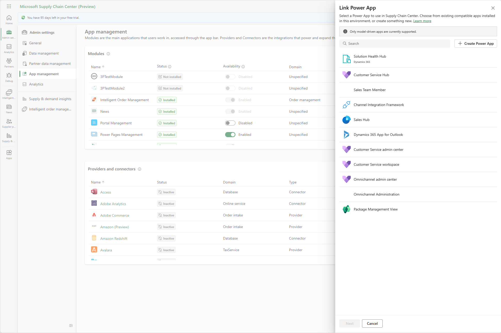
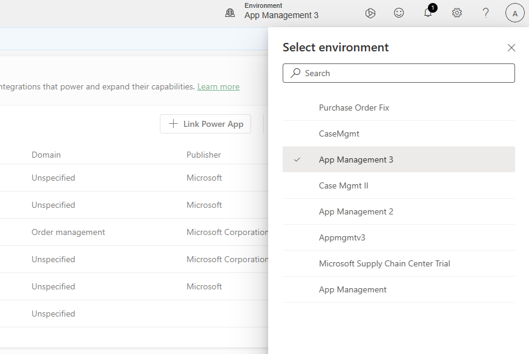

# Bring your own Power Apps

Companies can customize Supply Chain Center to meet their unique business requirements and goals by connecting various first and third party supply chain applications. Supply Chain Center provides administrators an easy-to-use [App management experience](appmanagement.md) to search through a comprehensive list of applications and install and configure those apps for their organizations. 

Applications are categorized as:

- **Modules**: Modules are feature rich applications that provide an interface to perform tasks and view information. For example, Intelligent Order Management, Smart News, Overhaul, and CH Robinson.
 **Providers**: Providers are applications that transform data from another source to be used by Supply Chain Center or first party modules on Supply Chain Center. For example, FedEx, SAP, and Big Commerce.
- **Connectors**: Connectors are applications that provide a connection to another source. For examples, Snowflake, SQL, Azure Blob, and SAP Hana database.

Supply Chain Center may not currently have all the modules that you need. Therefore, Supply Chain Center is integrated tightly with [Power Apps](/power-apps/maker/) so you can create new apps or bring existing apps to Supply Chain Center. 

> [!NOTE]
> Currently you can only bring [model driven apps](/power-apps/maker/model-driven-apps/) to Supply Chain Center. Support for canvas apps will be provided in the future.

In the module section of the **App management** page, select **Link Power App** to bring your own Power Apps to Supply Chain Center. 

The side panel provides a list of current Power Apps in your Power App environment. The search bar on top of the list to also help you locate any specific Power Apps by name. Once you find the Power App you want to bring over, you can select it from the list, and then select **Next** on the bottom of the panel. 

You can select a domain for your Power App so it can be categorized in Supply Chain Center. If none of the domains fit, just choose **Unspecified**. The app is brought to Supply Chain Center in **Enabled** state, which means it's immediately made available to all users in your organization. If you would like to bring the app, but hold off on allowing users to access, set the **Availability** toggle to **disabled**.

The App management shows the app you just brought over in the list. If you set the app to **Enabled**, it appears in the **Installed** tab in the [App Browser](../use/appbrowser.md), and is accessible to all users in your org. 

> [!NOTE]
> If you can't find one of the Power Apps in your environment in the list, it may be in a different environment. To switch environments, close the side panel by clicking the "x" on top of the panel, and you will see the environment switcher on top of the Supply Chain Center page. Clicking in the environment switcher will slide out a side panel where you can switch your environments. 

If Supply Chain Center or your environment doesn't have the app you need, you can build your own. In the **Link Power App** side panel, select **Create Power App** to open the [Power App Maker portal](/power-apps/maker/model-driven-apps/build-app-three-steps) where you can create your own. Many customers partner with ISVs who have some expertise in Power Apps to assist them with creating new apps.
