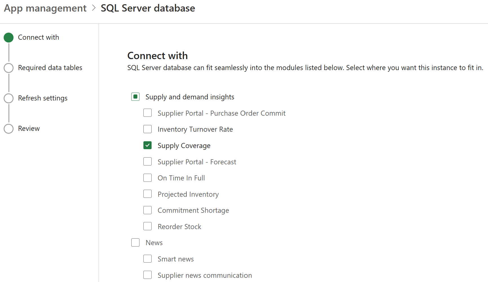
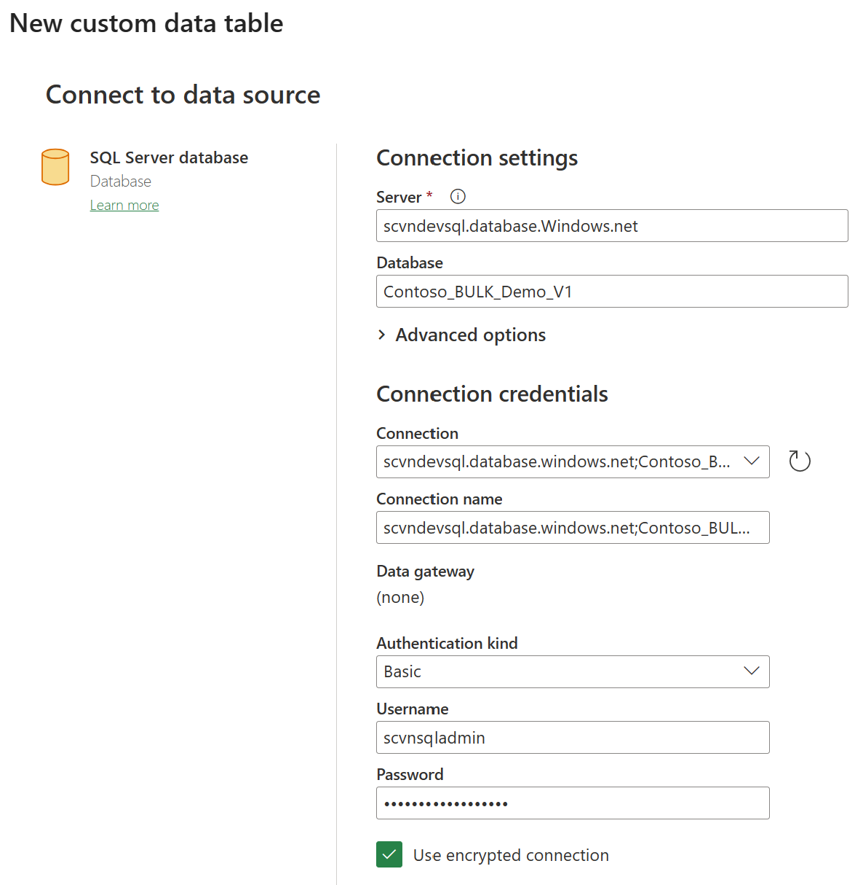
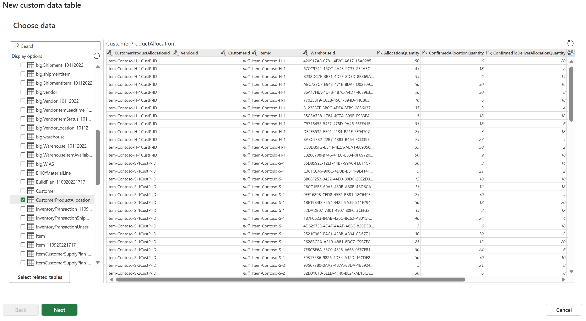
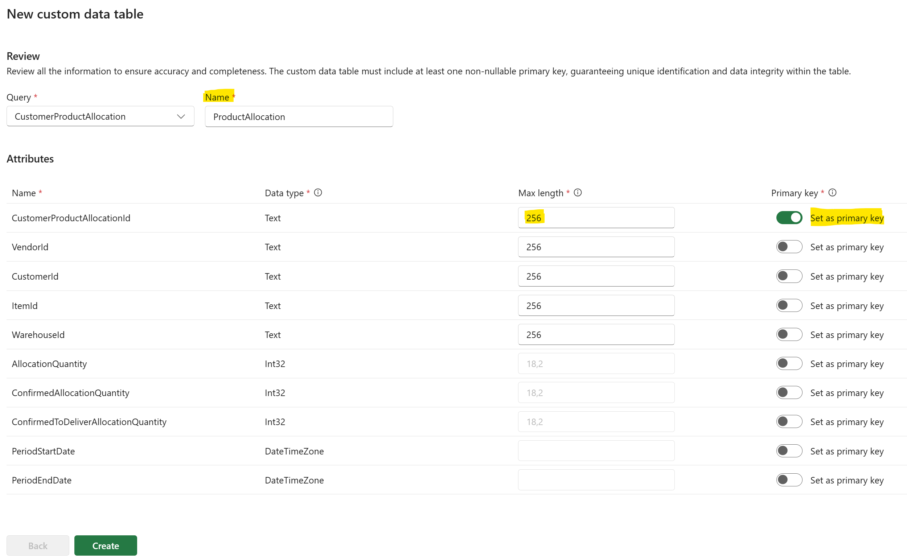

# **Bring your own entity (schema extensibility)**

Supply chain center allows users to extend or modify the structure of a schema in a database or data model. Schema extensibility is particularly useful in scenarios where the data requirements are subject to frequent changes or where the system needs to accommodate user-defined scenarios or customizable data structures. It promotes flexibility, scalability, and adaptability in data models. Schema extensibility enables customization and personalization of data models. This level of customizability empowers users to adapt the data model to their unique business scenarios, workflows and preferences. Extending the schema easily can enhance data analysis capabilities, connect to external risk signals and enable risk analysis, impact analysis and mitigation capabilities in Supply chain center.

## **How to define new schema**

In Supply chain center click on "Admin settings" on the left panel and click on "App management". Under "App management" choose any one of the connector and click new instance. Choose the scenario for which you would like to add these new entities.  

**Note**: Even if the entities are not for any specific scenario, choose one of the scenario as shown in screenshot below.

Click next to proceed to next page and on the next page click on Import custom data table. 

Depending upon the connector the next page varies. In this example since the connector is a "SQL Server Database", the connector expects connection and authentication related information to connect to source. 

From the next page select the entities that need to be created in Supply chain center. You can choose one or more of the entities and use the power of Power Query to define an entity that is combination of all the entities.

Click next. The user can change the title of the column name by double clicking on the title of the column. The user can also change the data type by clicking on the left corner of each column header as shown in screenshot below to change the data type of the column if required. Power query by default determines the data type based on the source.

Click next to proceed to define the name of the entity, primary keys of the entity and define length of the field as shown in screenshot below.

Click on create to create the new custom entity.
