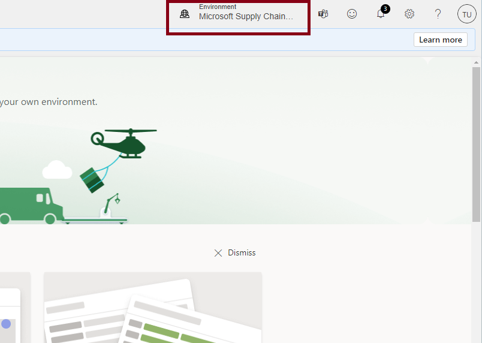
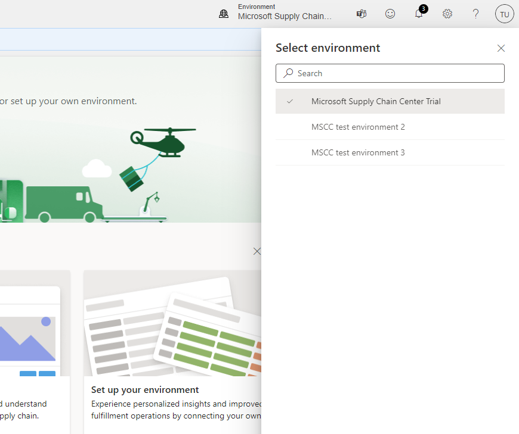

# Environment Picker

Within the header of MSCC, users can view which environment they are currently using. Some companies will have multiple environments of MSCC within a tenant.  For more information see [Sign up for a free trial](free-trial.md).

By selecting the environment name, a right hand panel will expand showing all other MSCC environments a user has access to. Please note only the list of environments shown will be:
- Dataverse environments with MSCC trial installed
- MSCC environments that the user has been added as a user to

For more information on how to add users to your MSCC environment please see [Add users](add-users.md). By default, these environments will be named “Microsoft Supply Chain Center Trial”. They can be renamed in the Power Platform admin center. 

Users can search for specific environments within the search bar to quickly find an environment. Please note that data ingested, applications installed, and any personal settings will not be persisted across environments. 
