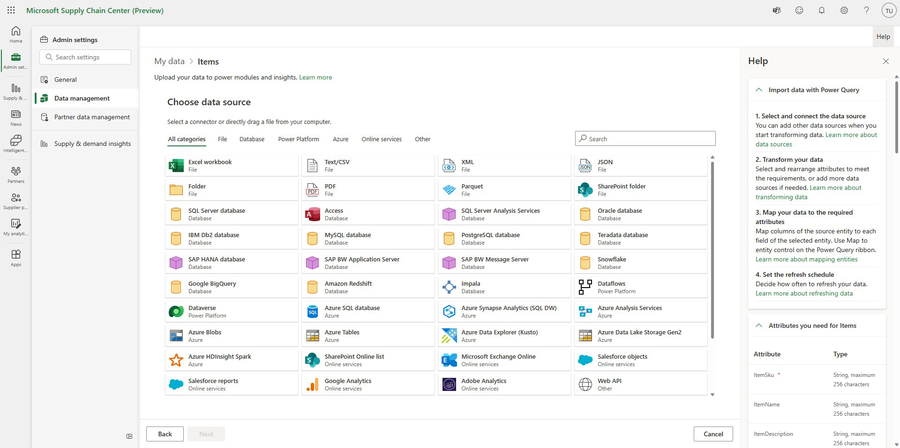
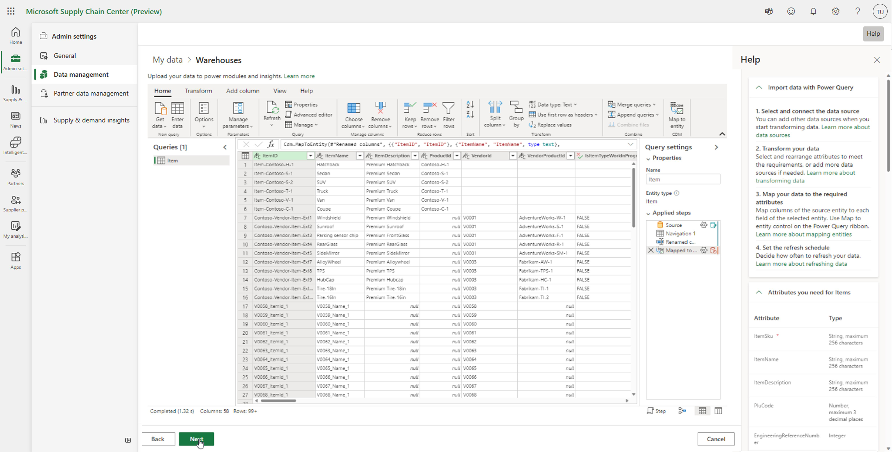

# Ingest data

Before you can start to use the Microsoft Supply Chain Center modules, Supply Chain Center requires data that is relevant to your supply chain. That data must be brought (ingested) into the application. Supply Chain Center uses [Power Query](/power-query/power-query-what-is-power-query) to help ensure a smooth data ingestion experience.

## Prerequisites

Data is ingested into Supply Chain Center in the form of tables, according to the Supply Chain Center data schema of entities and attributes. Although it's useful if your data tables are prepared according to the required entities and attributes, you can transform your data later in the ingestion process.

Before you ingest your data, review the information in [Compliance, privacy, and security](../overview/compliance-privacy-security.md) to ensure that Supply Chain Center meets your company's expectations.

## Ingesting data for the first time

When you signed up for Supply Chain Center, some sample data was provided to help you get started. Before you ingest your own data into Supply Chain Center, we recommend that you delete the sample data from your environment.

To remove preloaded sample data, follow these steps.

1. Select **Setting** (gear icon) in the upper-right corner to access the Admin Center.
1. In the Admin Center, select **General** in the left navigation.
1. Select **Remove data**
1. Select **Remove all data**

To learn more about data deletion, see [Admin settings](admin-settings.md).

### Get started

To start the ingestion process, follow these steps.

1. Select **Setting** (gear icon) in the upper-right corner to access the Admin Center.
1. In the Admin center, open **Data management**
1. Select **My data** to ingest data that represents your company, or select **Partner data** to ingest data that represents your business partners, such as suppliers or customers.
1. Select the module and function that you want to ingest data for to view all required entities for your the selected module and function.
1. Select the arrow button next to the entity that you want to upload to set up data ingestion.

The following video covers navigating to the Admin center and choosing an entity to ingest data for:

> [!Video https://www.microsoft.com/en-us/videoplayer/embed/RE5azzf]

### Connect your data to Supply Chain Center

To connect your data sources to Supply Chain Center, follow these steps.

1. Select the source where your data is stored, such as Azure SQL Database or Azure Data Lake Storage. If the data for a single entity is stored in two separate data sources, select one source to begin with. You can then add the second source later in the ingestion process.

2. Select **Next**.
3. Enter additional details, such as the source URL, credentials, and other parameters.

We recommend that your data contain all the required attributes of a given entity or have attributes that map to them, so that you can get the most value out of Supply Chain Center. However, if your data doesn't contain all the required attributes, you won't be prevented from ingesting it. After you set up the ingestion process, you can edit the configuration and perform additional transformations on your data.

> [!Video https://www.microsoft.com/en-us/videoplayer/embed/RE5aCe5]

### Connect your SAP data to Supply Chain Center

#### SAP ERP connector
The SAP ERP connector, in beta, enables users to extract data from their SAP system and allows you to invoke RFC and BAPI functions using on-premises data gateway. This SAP RFC connector is supported by Power Platform Dataflows within Supply Chain Center. 

##### Pre-requisites for SAP ERP connector
Enabling SAP ERP connector requires several pre-requisites to be completed. All pre-requisites must be completed on the same machine where extraction will be made and has admin permissions with access to the target SAP instance.   

  - Ensure the windows machine (64-bit OS) is updated and has access to the target SAP machine 
  - Ensure SAP credentials have requisite permission to run the desired RFC(s) or BAPI(s) 
  - Ensure SAP S User credentials can download the SAP .NET Connector installer 

**Setup instructions** 

The following installers must exist in desktop or virtual machine before using the connector: 

  - Go to SAP Connector for Microsoft .NET to download and install the NCo 3.0 for 64bit 
    - Do not install NCo 3.1 as this version is not yet supported  
    - Access to the download requires a valid S-user. You may need to reach out to your SAP team 
    - You must choose the 64-bit version, the 32-bit version will not work 
    - During installation, in the Optional setup steps window, make sure to select the Install assemblies to GAC option 
  - Install the SAP RFC Reader (V0.1.02232.26) which is an ADO.NET provider found here. 
    - .NET Framework 4.7.2 or greater is required 
    - Supported by Windows 10, Windows 11, Windows Server 2012 R2, Windows Server 2016, Windows Server 2019, Windows Server 2022 
  - Install the Power Query On prem Data gateway (https://go.microsoft.com/fwlink/?LinkId=2116849&clcid=0x409). To learn more about the gateway requirements or for support, follow this link (https://learn.microsoft.com/en-us/data-integration/gateway/service-gateway-install). 

**Connection Settings: Connecting to SAP RFC** 

To instantiate your dataflow connection to SAP ERP connector you will need to create a connection string. With the following parameters: 

|          **Name**         |       **Key**       |     **Required**    |          **Type**          |            **Description**              |
|---------------------------|---------------------|---------------------|----------------------------|-----------------------------------------|
|AS Host|AppServerHost|Application Server|string|The hostname of the SAP Application Server|
|Client | Client |Application and Message Server |Integer |The SAP client ID to connect to the SAP system|
|AS System Number|SystemNumber|Application Server|Integer| The SAP System’s System Number. It is a number ranging from 00 to 99 |  
| Message Server | MessageServerHost |Message Server|String|Hostname of the SAP System’s Message server| 
|Message Server Service Name/Port| MessageServerService | Message Server |String |Service Name or the Port Number under which the Message Server is listening for load balancing requests| 
| System ID | SystemID | Message Server | String | SAP systems three-letter system ID |
|Logon Group |LogonGroup |Message Server |String | The Logon Group for the SAP system from which the Message Server shall select and Application Server |
|Logon Type | LogonType |Application and Message Server |String | The type of logon to the SAP system, either application server logon (type A) or Group Logon (Type B aka Message Server). Values can be “ApplicationServer” or “Group” |

Setup SAP system connection string - This connector supports SAP authentication only currently. Constructing the script is dependent on connection type and is outlined below:  

  - **Application Server:**  

      - Connection string template: {"AppServerHost":"<application server>","Client":"<client id>","SystemNumber":"<system number","LogonType":"ApplicationServer"} 

      - You will want to replace everything in <> with your application server system settings eg for a server sap.contoso.com with system number 00 and client id 100         it would be {"AppServerHost":"sap.contoso.com","Client":"100","SystemNumber":"00","LogonType":"ApplicationServer"} 

  - **Message Server:** 

      - Connection string template: {"MessageServerHost": "<message server>", "MessageServerService":"<message server service name/port>", "LogonType": "Group",               "SystemID": "<system id>", "Client": "<client id>", "LogonGroup":"<logon group>"} 

      - You will want to replace everything in <> with your message server system settings noting that you may or may not require both MessageServerService and                 SystemID eg for a server 10.0.0.1 with messge server port 3333 and client id 800 and logon group COTO it would be {"MessageServerHost": "10.0.0.1",                     "MessageServerService":"3333", "LogonType": "Group", "Client": "800", "LogonGroup":"COTO"} 

  Although **Data gateway** is not marked as a requirement in connection settings, identifying the Data Gateway will be required for connecting to the SAP ERP connector.  
  
**Enabling Function Parsing**

 After connections the RFC will show up as a function with the parameter metadata and an optional “Enable Function Parsing” option. Fill in the parameters and click Invoke to get the data. Users should rely on their SAP produced documentation or custom documentation for RFC parameters.  

The function parsing mode for the connector understands contracts of two widely used RFCs: RFC_READ_TABLE and /SAPDS/RFC_READ_TABLE2. They will take this interpretation and parse out the output in an easy to read format instead of requiring the user to do so in M script. Function parsing can be enabled not only for the above mentioned RFCs but also for RFCs with the same contract such as BBP_RFC_READ_TABLE or /BODS/RFC_READ_TABLE2 including custom RFCS deployed by the customer to the SAP system. 
  
**Authentication**
  
The SAP ERP connector only supports basic SAP Authentication. Because the connector is designed to be used by multiple users of an app, the connections are not shared. Rather, each user will authenticate with the SAP system.  
  
**Known Issues and Limitations**

The following are some of the known issues and limitations of the SAP ERP Connector: 

  - The connector supports only RFCs and BAPIs 
  - The connector does not support receiving messages from SAP Server 
  - Transactional RFCs (tRFCs) are not supported. 
  - The gateway has a 2-MB payload limit for write operations and an 8-MB compressed data response limit for read operations 
  
  
**Frequently Asked Questions (FAQ)**

**Q**: The SAP ERP Beta connector is labeled as 3rd Party, is this connector not created or managed by Microsoft?
  
**A**: The connector was created by Microsoft and is managed by Microsoft. As a beta connector it will hold a “3rd party” label until it becomes generally available.  

**Q**: I am getting the following error when attempting to connect “The given data source kind is not supported Data source kind SAPERP”, how do I address?  
**A**: As a custom connector we default save the connection in your [System Drive]\Windows\ServiceProfiles\PBIEqwService\Documents\Power BI Desktop\Custom Connectors folder, if this folder does not exist or if gateway is configured to use a different custom connector folder you will see the above error. To remediate the user will need to copy the SAPERP.mez connector file from [System Drive]\Windows\ServiceProfiles\PBIEqwService\Documents\Power BI Desktop\Custom Connectors and copy in to the folder that you configured in your gateway.  

**Q**: Do I always need to identify a Data gateway in connection settings?
**A**: As part of connection setting you must identify a Data gateway in order to successfully connect through the SAP ERP connector 

**Q**: My connection continues to fail, what can I do to remediate? 
**A**: Make sure to check that installers described above are up to date and current. Reinstalling drivers may solve your connection issues.  

### Import a local file

An [on-premises data gateway](/data-integration/gateway/service-gateway-onprem) is required to import local files from your computer into Supply Chain Center. For information about how to install an on-premises data gateway, see [Install an on-premises data gateway](/data-integration/gateway/service-gateway-install). After you install the gateway, you must use your Supply Chain Center user credentials to sign in to the application. Then make sure that the local folder that contains the file that you want to upload is configured so that access is granted to everyone. To change this configuration, go to the folder, select and hold (or right-click) it, and then select **Give access to > Specific people**.

>[!Note]
> There are two types of on-premises data gateways: personal mode and standard gateway. Don't install the personal mode on-premises data gateway. Install the standard on-premises gateway instead.

### Transform and map the data according to your desired entity

The next step in the ingestion process is to transform and map your data. First, transform your data into the required [Supply Chain Center data schema](data-schema.md).

You can use the Power Query editor to transform your data into a single query that has one table that contains all attributes of an entity. Transformation and mapping of your data have to be done only once for an entity, provided that you don't change the data sources.

After you've created a single query that has the table that contains the data that you want to import, map your table columns into the Supply Chain Center entities attributes, so that your data can be analyzed and made available for the different Supply Chain Center modules. You can view the required and optional attributes for the entity on the right side of the page.

To map your table columns to the Supply Chain Center entity attributes, follow these steps.

1. Select **Map to entity** in the upper right.
1. In the **Map to CDM entity** dialog box, select the entity in the left column, and then select **Auto map**. Supply Chain Center will use the column headers of the query table to determine which column represents which attribute.
1. To ensure that automatic mapping is run correctly, select the **Mapped attributes** column together with the **Data preview** table at the bottom of the page. If an error occurs, or if you prefer to do the mapping manually, select the option for the required attribute in the **Mapped attributes** column, and then select the appropriate column header name.
1. When you've finished, select **Done**.

> [!Video https://www.microsoft.com/en-us/videoplayer/embed/RE5cnCu]

### Ingest data into one entity from multiple data sources

If you must add data to an existing entity from additional data sources, select **Get Data** on the **Home** tab in the upper left of the Power Query editor. You're prompted to complete the connection process again to add another source. Another query will be created that includes the data from the new source. As a result, you might have multiple queries in Supply Chain Center. You must then merge those queries or append them into one query before you map the table columns to the entity attributes.

We recommend that you delete all queries except the one where you will perform the column-to-attribute mapping. If you don't remove other existing queries, the wrong data might be uploaded. For more information about how to load and transform data by using the Power Query editor, see [Use Power Query to transform data](/power-query/power-query-ui).

### Select the refresh schedule and complete the setup process

To finalize the ingestion setup, the last step is to select the refresh schedule. A refresh schedule automatically updates the ingested data for a given entity, based on any changes that were made to that data in your cloud storage solution. Up-to-date data is critical for deriving recent and relevant insights.

- To perform a one-time data ingestion, select **Refresh Manually**. The data connection won't be refreshed again until you choose to do so.
- For continuous data refresh, select **Refresh Automatically**, and enter the desired schedule.
- To finish the setup and initiate the ingestion process, select **Finish setup**. If you selected **Refresh Automatically**, ingestion will begin according to the selected refresh schedule.

After you've finished the ingestion setup, you can review the status of your ingested entities and apply any updates that are required. For more information, see the [Review, update, and delete your data](review-update-delete-data.md) section.

> [!Video https://www.microsoft.com/en-us/videoplayer/embed/RE5amRA]
