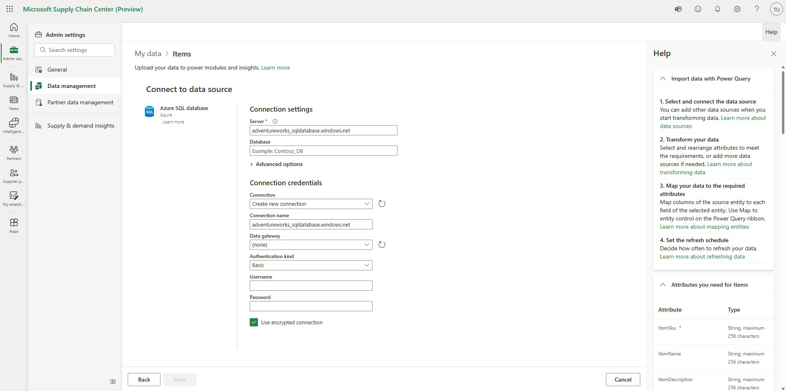
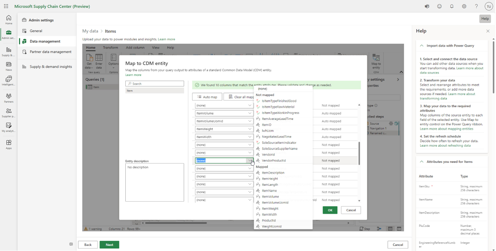

# Ingest data

Before you can start to use the Microsoft Supply Chain Center modules, Supply Chain Center requires data that is relevant to your supply chain. That data must be brought (ingested) into the application. Supply Chain Center uses [Power Query](/power-query/power-query-what-is-power-query) to help ensure a smooth data ingestion experience.

## Prerequisites

Data is ingested into Supply Chain Center in the form of tables, according to the Supply Chain Center data schema of entities and attributes. Although it's useful if your data tables are prepared according to the required entities and attributes, you can transform your data later in the ingestion process.

Before you ingest your data, review the information in [Compliance, privacy, and security](/overview/compliance-privacy-security.md) to ensure that Supply Chain Center meets your company's expectations.

## Ingesting data for the first time

When you signed up for Supply Chain Center, some sample data was provided to help you get started. Before you ingest your own data into Supply Chain Center, we recommend that you delete the sample data from your environment.

To remove preloaded sample data, follow these steps.

1. Select **Setting** (gear icon) in the upper-right corner to access the Admin Center.
1. In the Admin Center, select **General** in the left navigation.
1. Select **Remove data**
1. Select **Remove all data**

To learn more about data deletion, see [Admin settings](/administer/admin-settings.md).

### Get started

To start the ingestion process, follow these steps.

1. Select **Setting** (gear icon) in the upper-right corner to access the Admin Center.
1. In the Admin center, open **Data management**
1. Select **My data** to ingest data that represents your company, or select **Partner data** to ingest data that represents your business partners, such as suppliers or customers.
1. Select the module and function that you want to ingest data for to view all required entities for your the selected module and function.
1. Select the arrow button next to the entity that you want to upload to set up data ingestion.

### Connect your data to Supply Chain Center

To connect your data sources to Supply Chain Center, follow these steps.

1. Select the source where your data is stored, such as Azure SQL Database or Azure Data Lake Storage. If the data for a single entity is stored in two separate data sources, select one source to begin with. You can then add the second source later in the ingestion process.

2. Select **Next**.
3. Enter additional details, such as the source URL, credentials, and other parameters.

We recommend that your data contain all the required attributes of a given entity or have attributes that map to them, so that you can get the most value out of Supply Chain Center. However, if your data doesn't contain all the required attributes, you won't be prevented from ingesting it. After you set up the ingestion process, you can edit the configuration and perform additional transformations on your data.

### Import a local file

An [on-premises data gateway](/data-integration/gateway/service-gateway-onprem) is required to import local files from your computer into Supply Chain Center. For information about how to install an on-premises data gateway, see [Install an on-premises data gateway](/data-integration/gateway/service-gateway-install). After you install the gateway, you must use your Supply Chain Center user credentials to sign in to the application. Then make sure that the local folder that contains the file that you want to upload is configured so that access is granted to everyone. To change this configuration, go to the folder, select and hold (or right-click) it, and then select **Give access to > Specific people**.

>[!Note]
> There are two types of on-premises data gateways: personal mode and standard gateway. Don't install the personal mode on-premises data gateway. Install the standard on-premises gateway instead.

### Transform and map the data according to your desired entity

The next step in the ingestion process is to transform and map your data. First, transform your data into the required [Supply Chain Center data schema](data-schema.md).

You can use the Power Query editor to transform your data into a single query that has one table that contains all attributes of an entity. Transformation and mapping of your data have to be done only once for an entity, provided that you don't change the data sources.

After you've created a single query that has the table that contains the data that you want to import, map your table columns into the Supply Chain Center entities attributes, so that your data can be analyzed and made available for the different Supply Chain Center modules. You can view the required and optional attributes for the entity on the right side of the page.

To map your table columns to the Supply Chain Center entity attributes, follow these steps.

1. Select **Map to entity** in the upper right.
1. In the **Map to CDM entity** dialog box, select the entity in the left column, and then select **Auto map**. Supply Chain Center will use the column headers of the query table to determine which column represents which attribute.
1. To ensure that automatic mapping is run correctly, select the **Mapped attributes** column together with the **Data preview** table at the bottom of the page. If an error occurs, or if you prefer to do the mapping manually, select the option for the required attribute in the **Mapped attributes** column, and then select the appropriate column header name.
1. When you've finished, select **Done**.

### Ingest data into one entity from multiple data sources

If you must add data to an existing entity from additional data sources, select **Get Data** on the **Home** tab in the upper left of the Power Query editor. You're prompted to complete the connection process again to add another source. Another query will be created that includes the data from the new source. As a result, you might have multiple queries in Supply Chain Center. You must then merge those queries or append them into one query before you map the table columns to the entity attributes.

We recommend that you delete all queries except the one where you will perform the column-to-attribute mapping. If you don't remove other existing queries, the wrong data might be uploaded. For more information about how to load and transform data by using the Power Query editor, see [Use Power Query to transform data](/power-query/power-query-ui).

### Select the refresh schedule and complete the setup process

To finalize the ingestion setup, the last step is to select the refresh schedule. A refresh schedule automatically updates the ingested data for a given entity, based on any changes that were made to that data in your cloud storage solution. Up-to-date data is critical for deriving recent and relevant insights.

- To perform a one-time data ingestion, select **Refresh Manually**. The data connection won't be refreshed again until you choose to do so.
- For continuous data refresh, select **Refresh Automatically**, and enter the desired schedule.
- To finish the setup and initiate the ingestion process, select **Finish setup**. If you selected **Refresh Automatically**, ingestion will begin according to the selected refresh schedule.

After you've finished the ingestion setup, you can review the status of your ingested entities and apply any updates that are required. For more information, see the [Review, update, and delete your data](review-update-delete-data.md) section.
