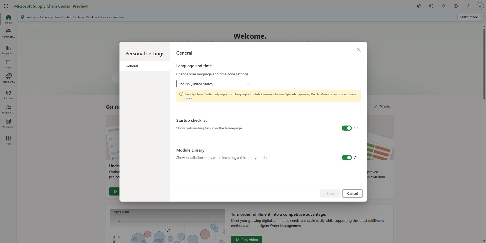

# Personal settings

The **Personal settings** feature lets you save your preferences for the following options:

- Language preference
- Startup checklist
- Module library installation checklist

## Supported languages

Microsoft Supply Chain Center currently supports the following languages:

- English (United States)
- German (Germany)
- Chinese (Simplified)
- Spanish (Spain)
- Japanese (Japan)
- Dutch (Netherlands)

## Startup checklist & Module library installation steps

You can toggle on/off the display of onboarding videos on the home page. Within these settings you can toggle on or off the overview of installation process for independent software vendors (ISVs) modules. Both these settings are enabled by default. Any changes take effect after you select **Save**, and they are preserved for future sessions.

### Change your personal settings

To change your personal settings, follow these steps.

1. From any page in Supply Chain Center, select **Settings** (the gear symbol), and then select **Personal settings**.
1. Make your selections on the **General** tab, and then select **Save**. Users can change their language preferences, decide whether they want the startup checklist to appear on the home page, and decide if they want the ISV module installation steps to show on the module library page.

> [!Note]
> Your changes take effect immediately when you select **Save**. The updated settings will be saved for future sign-ins.
