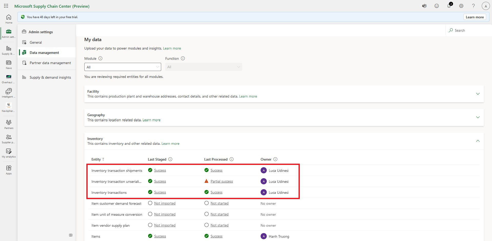
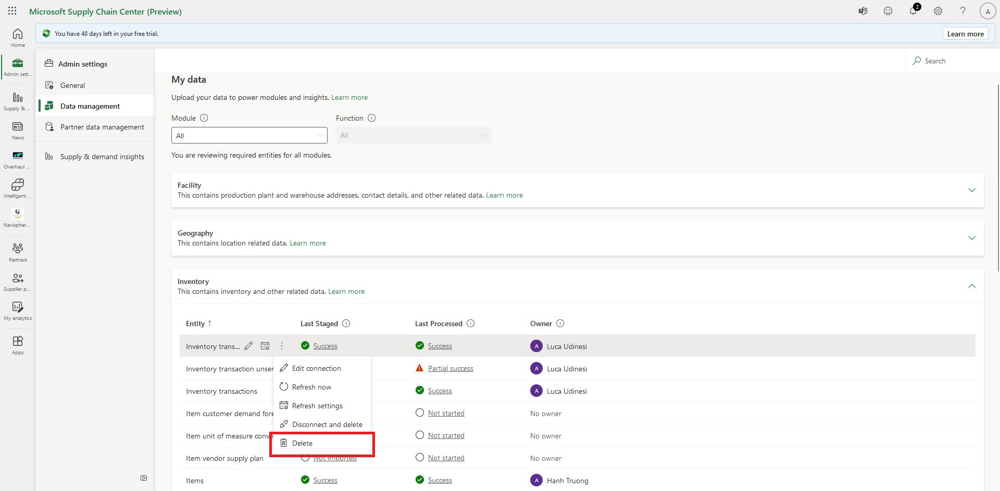
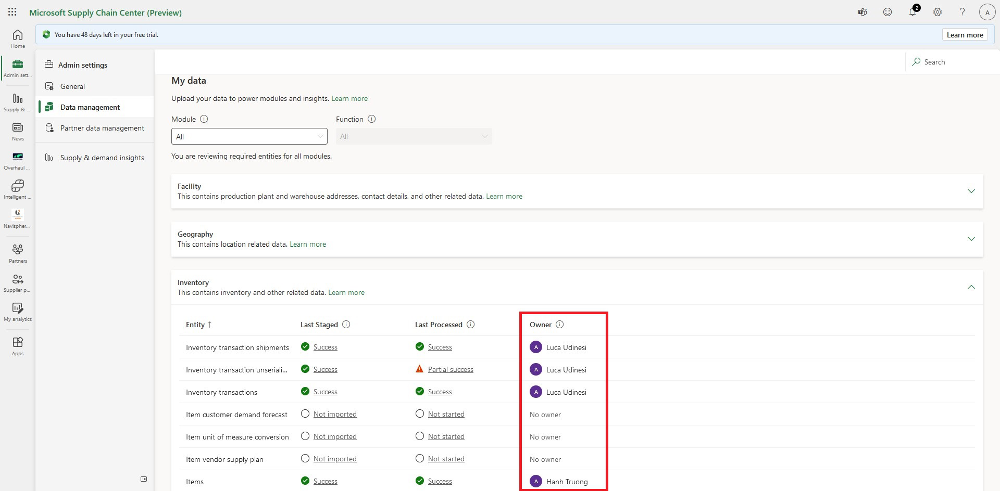

# Review, update, and delete your data

After your data is ingested into Microsoft Supply Chain Center, you can review its status, update any connection and configuration, or delete the data. You can determine that an entity has been ingested or is in the process of ingestion if its **Last Staged** or **Last Processed** status is something other than **Not imported** or **Not started**, as shown in the following illustration.

## Review the ingested data

During the ingestion process, an entity is first staged, and then periodically processed for analytical purposes and for use in different modules. To learn more about how to set the processing refresh rate to get relevant insights and analytics, see the [Admin settings](admin-settings.md) section.

The **Last Staged** and **Last Processed** statuses show the data state for each entity in **My data** or **Partner data**. If the **Last Staged** status is **Success**, the entity was successfully staged. Data is processed for analytics according to the refresh rate that is configured.

To review the last time that an entity was ingested and staged, or to triage any errors in the ingestion process, follow these steps.

1. On the **Data Management** page, select the **Last Staged** status.
1. In the **Progress Details** pane, view the status of your ingested data for a given entity, past data synchronizations, and any error statuses.
1. To view the data processing status, on the **Data Management** page, select the **Last Processed** status for the entity.

### Viewing your data

Supply Chain Center is powered by Microsoft Power Platform and Dataverse. Your data is stored in a Dataverse environment. You can access your Dataverse storage by using any data explorer, such as Azure Storage Explorer. Generation of an SAS token is required to view your data. For more information, see [Access your storage with an SAS token](https://learn.microsoft.com/power-platform/admin/storage-sas-token).  

## Update the entity ingestion configuration

To ensure that your data is available for the different Supply Chain Center modules, insights, and analytical capabilities, you should make sure that your data connectors are intact, the data is transformed and mapped according to the Supply Chain Center schema, and the data is ingested at the desired refresh rate.

If you must make configuration changes to the ingestion process of an entity, follow these steps.

1. On the **Data Management** page, select the menu button (three vertical dots) next to the entity name.
1. Select one of these options on the menu:
   - Select **Edit connection** to update the connection configuration for your data source.
   - Select **Refresh now** to trigger immediate data ingestion and staging.
   - Select **Refresh settings** to update the refresh frequency settings for the entity.
   - Select **Disconnect** to remove the existing data source connection for the entity. Any data that was staged will continue to be processed for analytical purposes and for use in different modules.

To completely remove an entity, see the Delete data section below.

## Delete data
You might want to delete your data for different reasons:

- You ingested the wrong data.
- You noticed an error for the ingested data, such as an incorrect mapping of attributes or duplicate values.
- The data is no longer relevant and is skewing reports.

Data deletion lets you delete all entries of an entity that has been ingested into Supply Chain Center. After an entity is deleted, you can ingest the data again into the same destination entity.

To delete the data of a single entity, on the **Data Management** page, select the menu button for the entity that you want to delete, and then select **Delete** on the menu.

To delete the data of all entities in Supply Chain Center, follow steps in the [Admin settings](admin-settings.md) section.

>[!Note]
> Even after you delete data, it will continue to be refreshed for the deleted entity if your connection to the data source is still active. The data will be deleted, and its refresh will stop, only after you disconnect an entity. To make sure that no data is refreshed, disconnect the deleted entity’s data connection.

## Disconnect from cloud storage providers

You might want to stop the refresh of data for a selected entity if the data source is no longer relevant or its data is incorrect. _Disconnection will stop the data refresh of an entity and delete all entries of the disconnected entity._

To disconnect and delete the data of a single entity, on the **Data Management** page, select the menu button for the entity that you want to delete, and then select **Disconnect** on the menu.

>[!Note]
> You must be the data connection owner of an entity in order to disconnect it. The data connection owner of an entity is the user who sets up the data connection and the ingestion configuration. For an entity where you are the data connection owner, **You** will be shown as the owner in the **Owner** column. If you aren’t the data connection owner of an entity, you will see the owner’s user name in the **Owner** column.

