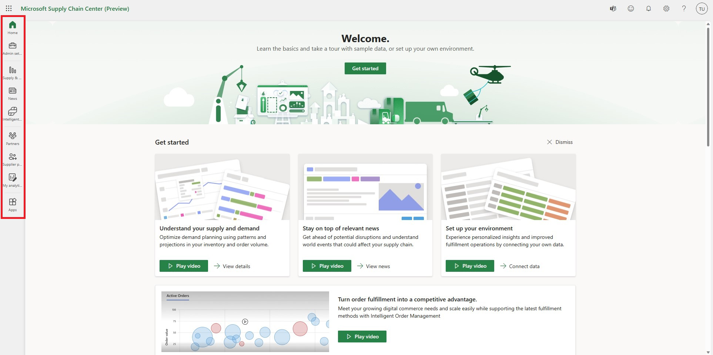
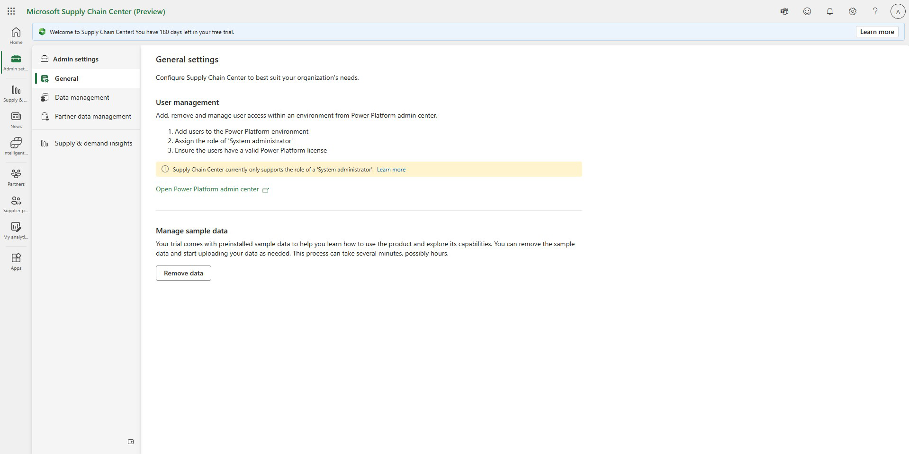
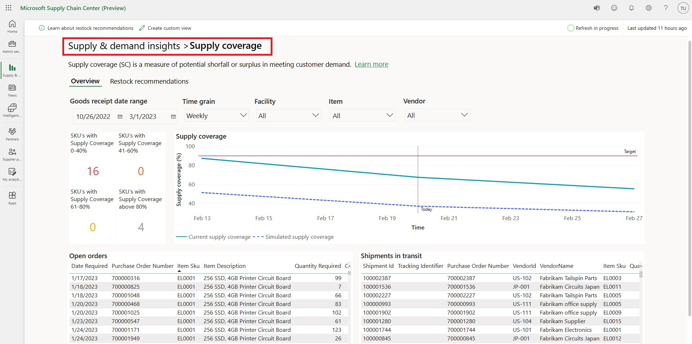
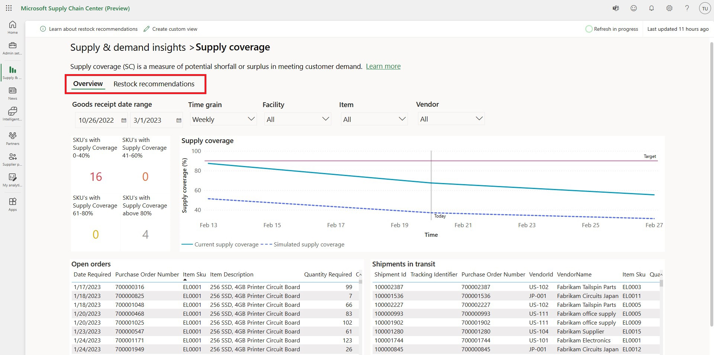

# Understand the UI (learn the basics)

This article provides some tips and tricks that can help you navigate Supply Chain Center and all its features.

## Title pane

The title pane is located at the gray bar at very top of the page. It's always accessible to Supply Chain Center users, regardless of where they are in the application.

The icons in the title pane give you access to various features. From left to right, the following are the accessible features:

- **App launcher** – Access other Microsoft products.
- **Feedback** – Send feedback to the Supply Chain Center team.
- **Notifications** – Set up your notifications.
- **Settings** – Access your personal settings, the admin center, and the Power Platform admin center.
- **Help** – Access Supply Chain Center help resources, such as documentation and support.
- **Profile Picture** – View information about your Microsoft account or Office products.

## Navigation pane

The navigation pane is always located on the left side of the page and provides access to key features in Supply Chain Center. The Menu button (sometimes referred to as the hamburger button) at the top of the navigation pane lets you shrink or enlarge the pane.

The content of the navigation pane changes if you are in the admin center or not. When outside of the admin center, the navigation panel gives end users quick access to commonly used features such as the enabled modules.

The Admin Center contains Supply Chain Center settings and data management, so the navigation pane updates to reflect these capabilities shown in the image below. For more information, see [Admin Settings](/administer/admin-settings.md).

## Main pages

Many main pages also contain secondary navigation components, namely breadcrumbs and pivots, that help you organize the information in different ways.

The following illustration shows the **Supply & demand** module's **Supply coverage** details page, which contains both breadcrumbs and pivots.

### Breadcrumbs

Breadcrumbs help you understand where you are in the application. Each breadcrumb represents a page that you've visited, and the final breadcrumb is the page that you're currently on. Breadcrumbs help organize information based on specificity. The more breadcrumbs there are, the more detailed or specific the information is.

In the following illustration, the **Supply coverage** page contains more detailed information about the supply coverage key performance indicator (KPI) that is found on the **Supply & demand insights** page. When you've finished reviewing the Supply coverage page, you can select the Supply & demand mismatch breadcrumb to return to that page.

### Pivots

Pivots are used to navigate between two or more areas of related content. In the following illustration, the **Supply coverage** page has two pivots: **Overview and Restock recommendations**. **Overview** is the pivot that is currently being shown, as the underline and bold text indicate. Select Restock recommendations to switch to that pivot.

Because many pivots are on the same page, they are based on the same level of the information hierarchy and usually provide a similar amount of detail. In this way, pivots differ from breadcrumbs, where pages increase in their specificity.
