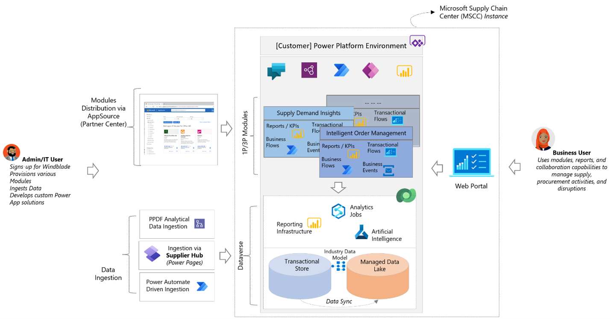

# Architecture

Microsoft Supply Chain Center is built on top of Microsoft Power Platform. It consists of multiple modules that work well with each other and help you respond to their supply chain challenges. You can choose modules from the module library, and then integrate and ingest the required data from their system of records. You not only get the functionality of the selected modules, but you can also utilize the full potential of Power Platform to develop your digital supply chain solutions.

The following diagram provides a high-level overview of Supply Chain Center's architecture, described in more detail below.

## Supply Chain Center Deployment

Supply Chain Center is deployed in a Power Platform environment in your tenant. Supply Chain Center modules are installed as solutions in that environment. Supply Chain Center leverages Microsoft Dataverse for its data ingestion, storage, and event needs.

Business users interact with Supply Chain Center using a dedicated web portal that allows them to use its capabilities to carry out their supply chain responsibilities. In addition, advanced users and IT admins can access the underlying Power Platform features (such as Power Apps) directly through Power Platform's web portal to further customize and extend Supply Chain Center's functionality.

### Power Platform Components

This section talks through Power Platform components used by Supply Chain Center in more detail.

#### Dataverse

Supply Chain Center ingests, stores and manages all supply chain data for its modules in Dataverse. You can store data for OLTP scenarios in Dataverse SQL tables and store data for batch analytical scenarios in Dataverse Files.

#### Data Schema

Supply Chain Center expects all its data to conform to a common schema for its various modules to interoperate with each other. Supply Chain Center's schema is based on [Microsoft Azure Synapse Database Templates](/azure/synapse-analytics/database-designer/overview-database-templates) schema, which is a large set of schemas that span multiple industry verticals, including supply chain and logistics. For more information on the data scheme used in Supply Chain Center, see [Data schema](../administer/data-schema.md)

#### Ingestion

As shown in the diagram above, there are multiple ways of ingesting data in Supply Chain Center. You can connect to your source ERP systems, pull and transform the data into the Supply Chain Center schema using Microsoft Power Query Dataflows. You can also leverage the Supplier portal to request structured information (such as PO commits) from your suppliers. See [Ingest data](../administer/ingest-data.md) and [Supplier portal](../use/supplier-portal.md) to learn more.

#### Transactional Data

Data for OLTP scenarios, such as order management is stored in Dataverse SQL tables. This data can be ingested, queried, and modified using Power Platform services such as Microsoft Power Query, Microsoft Power Automate, Microsoft Excel files as well as programmatically though Dataverse's OData APIs.

#### File Data

Data for batch analytical scenarios is ingested through Power Query dataflows and stored as Files in Dataverse's file storage. Modules that provide analytical insights are then powered on top of the ingested data in Dataverse's managed data lake.

#### Modules

Modules are self-contained pieces of functionality that you can install for your specific supply-chain needs. Modules are discoverable using the module library, and are packaged and deployed as Power Platform solutions that adhere to the [Azure Synapse Database Templates](/azure/synapse-analytics/database-designer/overview-database-templates) schema. This allows different modules, both published by Microsoft as well as by an ISV, to interoperate with each other.

Some modules have their UX deeply integrated into the Supply Chain Center web portal while others may have additional UX components outside of the web portal; however, all modules interoperate with each other as they operate on data that conforms to a common schema in Dataverse.

#### Additional Services

Because Supply Chain Center and its modules run on top of Power Platform, you can use the full breadth of functionality provided by Power Platform to customize and extend its functionality, including Power Automate, Power Apps, AI Builder and others. For example, you can leverage Power Automate to trigger and orchestrate workflows to tie Supply Chain Center data and events with the rest of your systems.

#### Web portal

Supply Chain Center includes a dedicated web portal through which business users can interact with the functionality provided by modules. As an example, they can look at critical supply chain KPIs, review relevant news articles that can impact their supply chain, etc.

In addition, IT admins can use the web portal's admin settings to discover and configure new modules and set up and monitor data ingestion and transformation pipeline..
