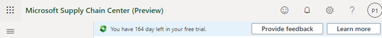

# Frequently asked questions

### What is Microsoft Supply Chain Center?

Microsoft Supply Chain Center is part of Microsoft's supply chain platform solution and is currently in public preview. Supply Chain Center is composed of Microsoft-built modules and independent software vendor (ISV)–built modules that address different needs from customers, depending on the supply chain challenges that they are seeking to solve. Because Supply Chain Center is built on [Microsoft Dataverse](https://learn.microsoft.com/power-apps/maker/data-platform/data-platform-intro), it facilitates the integration of data that comes from different sources. That data is then used by Supply Chain Center's modules to provide better visibility into the health of the customer's supply chain. Learn more about the [architecture](../overview/architecture.md).

### Where is my data stored?

During public preview, all data is stored in the United States within your Dataverse tenant.

### Will Supply Chain Center be available in the Microsoft Cloud for US Government?

For the preview, we aren't supporting the cloud for Government.

### Can I install Supply Chain Center in my existing Dataverse instance?

In the public preview of Supply Chain Center, you deploy Supply Chain Center in a new Dataverse instance. The Dataverse instance will be created in your tenant during the onboarding stage.

### Who will be potential users of Supply Chain Center?

All roles that need higher visibility into their supply chain and/or that must be able to collaborate with suppliers. Supply Chain Center capabilities bring value to supply chain managers, supply chain planners, logistics managers, directors, and C-levels. IT administrators and database managers will manage the ingested data and apply security controls.

### Do you have any resources for learning how to use Supply Chain Center and getting help?

We have extensive documentation, and videos are available in Supply Chain Center's user interface. For more information, see **What is Supply Chain Center?** Our [community portal](https://community.dynamics.com/365/microsoft-supply-chain-center) is the way to get support and connect with other Supply Chain Center users.

### What is the cost model for Supply Chain Center?

Supply Chain Center is in public preview. Therefore, there is no cost to use the application while the team is working closely with customers to gather feedback. Eventually, the product will go to general availability (GA). At that point, we will have a pricing model for it. The team will update this answer when more details become available.

### How is Supply Chain Center deployed? Will I have to maintain it?

Supply Chain Center is deployed as a solution in your Power Platform environment. Your data is stored in the Dataverse instance that accompanies the Power Platform environment, so that you have full control over that data. Supply Chain Center gets automatic updates that deliver feature updates and improvements without requiring any action on your part. For more information, see [Architecture](../overview/architecture.md).

### I have an idea for a feature that I want to see in Supply Chain Center. How can I tell you about it?

If something isn't working as expected, you have a suggestion, or you have a question, select the **Feedback** button (the happy face symbol) in the title bar, and then select **Provide Feedback**.

### How can I sign up for my company?

You can sign up for a free trial. For more information, see [Sign up for a free trial of Supply Chain Center's public preview](../get-started/free-trial.md).

### How does Supply Chain Center get set up?

For more information, see [Sign up for a free trial of Supply Chain Center's public preview](../get-started/free-trial.md).

### How do I add or remove users?

The Supply Chain Center portal provides tools for user management, and enables the addition, deletion, and modification of access to users. The assigned Supply Chain Center user role and access levels will determine the service elements that are available for the user. For more information about user management, see [Adding users](../administer/add-users.md).

### What are the "entities" that Supply Chain Center uses?

Entities are basically data tables. They are collections of attributes that are used to organize data in Supply Chain Center. Some examples of entities are Warehouse, Products, Orders, and Shipments.

### Which analytics does Supply Chain Center natively support?

For more information, see [Supply & Demand analytics overview](../use/supply-and-demand.md).

### How are the analytics calculated?

For more information, see [Supply & Demand analytics overview](../use/supply-and-demand.md).

### Can I personalize my analytics dashboards according to the ingested data?

Customizations aren't currently available.

### Can I create my own analytics in Supply Chain Center?

Custom analytics aren't currently available.

### How do I upload data into Supply Chain Center?

For more information, see [Ingest data](../administer/ingest-data.md).

### Do I need my supplier's data to use Supply Chain Center?

Some of the analytics of the Supply and Demand insights module rely on the availability of supplier data. Therefore, we encourage you to ingest the required supplier data into Supply Chain Center on your supplier's behalf.

### I currently receive data files from my suppliers. Can I use that data in Supply Chain Center?

Yes, you can ingest that data on behalf of your suppliers. You will have to provide credentials and access details for the source where your supplier data is stored. For more information, see [Ingest data](../administer/ingest-data.md).

### How similar or different are the data models of Supply Chain Center and Dataverse?

The out-of-box data schema of Dataverse is Common Data Model. This schema is frequently referred to as the Dataverse data model. Supply Chain Center is built by using [Microsoft Azure Synapse database templates](https://learn.microsoft.com/azure/synapse-analytics/database-designer/overview-database-templates), and that schema is used to store the data. Even though Supply Chain Center doesn't rely on Common Data Model, its modules interoperate with data in the Common Data Model schema.

### Which data connectors are available to ingest data into Supply Chain Center?

There are multiple connectors for ingesting your data into Supply Chain Center via Power Query. For a complete list, see [Connectors in Power Query](https://learn.microsoft.com/power-query/connectors/).

### Can I access the data in Supply Chain Center to create Power Apps apps or Power BI reports on top of it?

You can access data in Dataverse SQL tables in their Power Apps apps and Power Automate flows. For example, you can write apps that operate on top of the shipment milestone data that comes from a third-party solution, such as Navisphere from C. H. Robinson.

Analytical data for Power BI reporting is stored in Microsoft Azure Data Lake Storage and can be accessed by an organization's IT admin through SAS key authentication. SAS key authentication is not a recommended practice, and we advise you to store the analytical data from your systems of records in your Azure storage account. Analytical data that is produced by Supply Chain Center can be streamed out to customer Azure storage accounts through the Azure Synapse Link feature of Microsoft Power Platform.

### How will users access Supply Chain Center?

You access Supply Chain Center from the internet via a portal application experience, by using a web browser.

### What method of authentication does Supply Chain Center use?

Azure Active Directory (Azure AD) Authentication is the form of authentication that is supported by Supply Chain Center.

### Does Supply Chain Center have a mobile interface?

Supply Chain Center can be accessed by using any web browser on a mobile device. However, it doesn't currently have a specialized mobile interface.

### Is Supply Chain Center's data encrypted?

Supply Chain Center is built on top of Azure storage technologies, and the data is stored in the cloud in Azure data centers. All standard protocols are used to ensure strong security/safety around data. Supply Chain Center uses Azure storage encryption to ensure that all data at rest is encrypted. Azure Storage Service Encryption (SSE) automatically encrypts data before it's stored and automatically decrypts it during retrieval. The process is completely transparent to users. SSE uses 256-bit Advanced Encryption Standard (AES) encryption, which is one of the strongest block ciphers available. AES handles encryption, decryption, and key management transparently. In addition to standard Azure storage–supported encryption mechanisms, Dataverse supports customer-managed keys (CMKs) for encryption of customer content under Dataverse.
