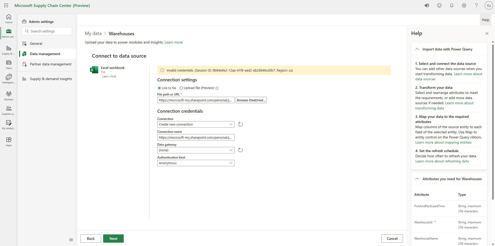
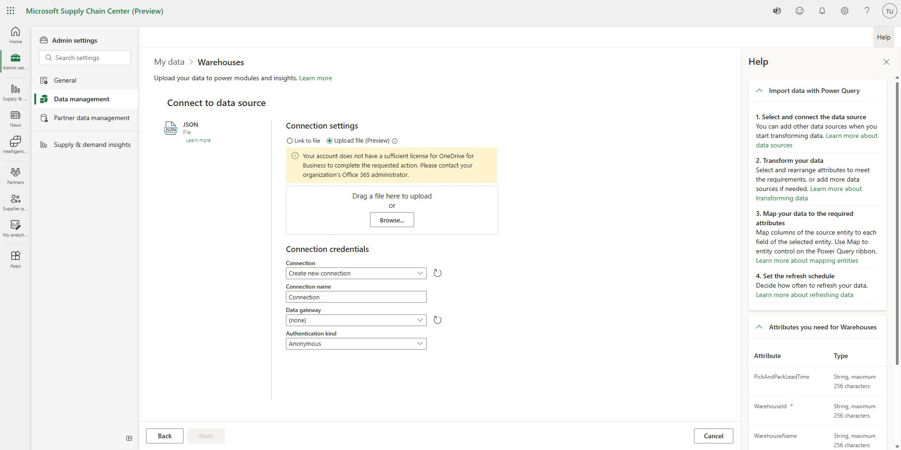

# Additional requirements and limitations

This article provides information about additional requirements and limitations.

## Sign-up requirements

### Azure AD tenant

A Microsoft Azure Active Directory (Azure AD) tenant is needed to sign up for a Supply Chain Center trial. If you don't have an Azure AD tenant, you can get one by signing up for a free [Microsoft 365 trial](https://www.microsoft.com/microsoft-365/try).  We recommend that you use a personal email address instead of a school or work email address to sign up for the free Microsoft 365 trial. In this way, you ensure that the email address isn't already associated with an existing tenant. After you've set up your trial, you should use the email address that is associated with it to sign up for the Supply Chain Center preview.

>[!Note.]
> Microsoft 365 free trials end after one month and require credit card information to help ensure that you don't experience any interruptions after your trial ends. Your credit card won't be billed until the end of the trial period. You can cancel at any time during the trial period by selecting **Turn off recurring billing** on your Microsoft 365 account page.

### Environment creation by non-admin users setting

If your company has an Azure AD tenant but is still experiencing sign-up issues, a Microsoft Power Platform setting might be the cause. Review your administrator setting to make sure that every user in the Azure AD tenant can create trial environments. There are two ways to change the setting, as described in [Control who can create and manage environments in the Power Platform admin center](/power-platform/admin/control-environment-creation). You can either use the Microsoft Power Platform admin center to let every user in the tenant create trial environments or create an environment by using PowerShell. If you follow the instructions for PowerShell, change the **DisableEnvironmentCreationByNonAdminUsers** setting to **$false**. After you've finished signing up and provisioning Supply Chain Center, you can change the setting back to **$true**.

### Cookies blocking sign-in

If you have trouble signing in to Supply Chain Center after you sign up, check your browser's settings, and enable third-party cookies.

## Data

### Required licenses for data sources 

The following data sources require that each user have a license to OneDrive for Business in order to [import data by using Power Query](/power-query/sharepoint-onedrive-files):

- Excel
- JSON
- PDF
- XML
- TXT/CSV

If you try to connect to one of these data sources without a license to OneDrive, you'll receive the following error messages:

> Invalid credentials. (Session ID: \<session ID\>, Region: \<region\>)

> Your account does not have a sufficient license for OneDrive for Business to complete the requested action. Please contact your organization's Office 365 administrator.

If your Azure AD tenant doesn't have a subscription to OneDrive, you can purchase a subscription or trial for [Microsoft 365 for Business](https://www.microsoft.com/microsoft-365/microsoft-365-business-standard-one-month-trial), including OneDrive and other Microsoft services. Alternatively, you can purchase a subscription to [OneDrive for Business](https://www.microsoft.com/microsoft-365/onedrive/compare-onedrive-plans?activetab=tab:primaryr2) alone. If you don't have a license assigned, but your Azure AD tenant has a subscription for OneDrive, your global admin can [assign licenses in Microsoft 365](/microsoft-365/admin/manage/assign-licenses-to-users) to individual Supply Chain Center users in the tenant. 

### Remove data functionality

In the **General** section of the Admin center, **Remove data** removes all data, including data that you imported for yourself, data that was imported on behalf of your partners, and that is data shared by partners. When you select **Remove data** for the first time, sample data is removed, but the data connectors aren't deleted. Depending on the refresh schedule that the owner set, your data might automatically be uploaded again.

### Delete functionality

In the **Data management** section of the Admin center, you can delete the data that was uploaded for a given entity. This functionality doesn't delete the data connectors. Therefore, depending on the refresh schedule that the owner set, your data might automatically be uploaded again.

### Disconnect and edit functionality

In the **Data management** section of the Admin center, you can delete the data that was uploaded for a given entity. This capability is limited to the owner of the data that was uploaded for a given entity.

## ISV modules

Independent software vendor (ISV) modules require an active license before they can be enabled, and the licenses can be obtained only by going directly to an ISV. For information about how to obtain the licenses for each ISV module, see Enabling ISV modules.

## Supplier portal

### Collaborations and data requests

Each data collaboration can be between only you and one supplier. Therefore, data requests can be sent to only one supplier at a time.

### Sign up for suppliers

If a supplier receives invitations from multiple Supply Chain Center customers, they must sign up for the supplier portal for each invitation. The same email address can be used for different supplier portals.

## Supply & demand mismatch module

### Restock recommendations

If your restock recommendations show 0 (zero), the quality of the data that you uploaded to Supply Chain Center might not be good enough to support a proper recommendation.
