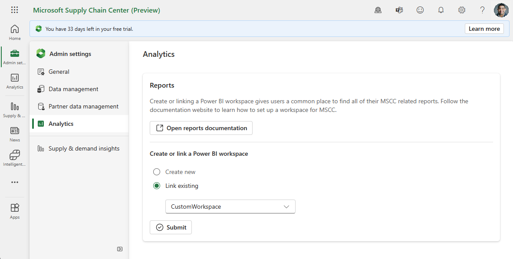
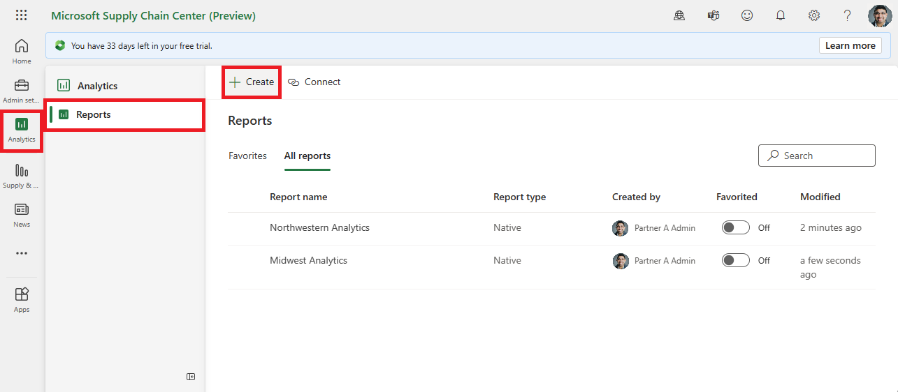
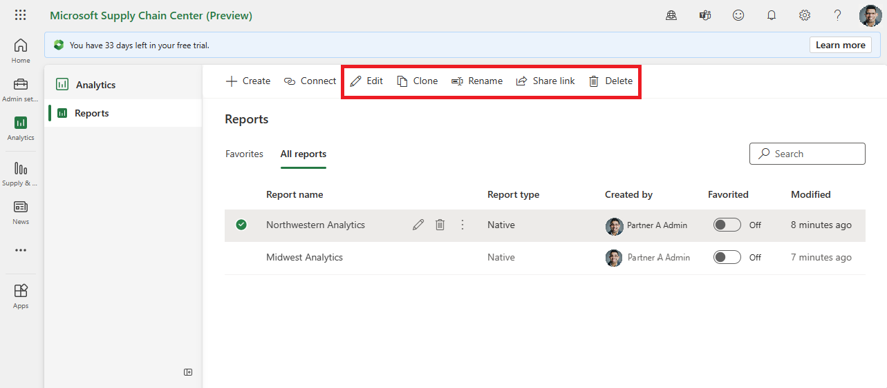

# Analytics

[!INCLUDE[banner](../includes/banner.md)]

The **Analytics** module in Microsoft Supply Chain Center empowers you to take advantage of your supply chain data through custom visualizations. By using the Dataverse-managed Power BI that comes with Supply Chain Center, or your own Power BI license, you can create dashboards to meet your supply chain needs.

## Adding reports

Supply Chain Center supports native reports and connected reports. Native reports are created in Supply Chain Center and are visible only in Supply Chain Center. Connected reports are linked from your Power BI workspace, and are accessible in both Power BI and Supply Chain Center.

### Connect reports from your Power BI workspace
The following sections explain how to connect reports from your Power BI workspace.

#### Link your Power BI workspace
Before connecting a report from your Power BI workspace, you must first link your workspace to Microsoft Supply Chain Center. Make sure the following prerequisites are met before doing so:

- You must have a Microsoft Power BI Professional or Microsoft Power BI Premium license.
- At least one report must be available in the Power BI workspace.
- You must have admin privileges for Supply Chain Center and Power BI.
- A system administrator must create a security group in Azure Active Directory (Azure AD) and add Dynamics 365 Supply Chain Visibility as a member of it. For information, see [Create a basic group and add members using Azure Active Directory](/azure/active-directory/fundamentals/how-to-manage-groups).
- A Power BI admin must add the previously mentioned security group to your Power BI service after they [enable the service principal in the Developer settings](/power-bi/enterprise/service-premium-service-principal#enable-service-principals.md) and [create workspaces in the Tenant settings](/power-bi/admin/service-admin-portal-workspace#create-the-new-workspaces.md) in the Power BI admin portal.
- You must add a security group that has Supply Chain Visibility as a member to your Power BI service in Azure AD.

#### Connect a Power BI report

After the prerequisites are met, a Supply Chain Center and Power BI admin can link an existing Power BI workspace or create a new one by going to **Admin settings \> Analytics \> Create or link a Power BI workspace** in Supply Chain Center. After a workspace is linked, you can connect a report from it by going to **Analytics \> Reports \> Connect**. If a workspace is unlinked, all connected reports are removed from the **Reports** tab of the **Analytics** module in Supply Chain Center. However, those reports can still be accessed through Power BI.

### Create new reports from templates
To create a native report from a template, go to the **Analytics** module, and then on the **Reports** tab select **Create**. Select **Start from template,** to choose a provided template, and then enter a name for the new report. Go back to the **Reports** tab to view the new report in **All reports**.

### Create new reports from scratch

Like creating native reports from templates, you can create connected reports from scratch. Go to the **Analytics** module, and then on the **Reports** tab, select **Create**. Select **Start from scratch,** enter a name, choose a workspace, and select a dataset corresponding to your selected workspace. The Power BI editor displays after selecting **Submit** and you can then create your report.

## Use existing reports

After you select a report in the grid on the **Reports** tab, you can use the buttons on the toolbar to edit, clone, rename, share, or delete it.

- **Edit** – You can edit a report to update it. For *connected reports*, your edits persist if you open the report from Power BI instead of Supply Chain Center.
- **Clone** – If you clone a *native report*, a new one that's identical is created. *Connected reports* can't be cloned.
- **Rename** – You can change the name of a report.
- **Share link** – When you share a report, a link is provided. You can give the link to others so that they can also view the report.
- **Delete** – If you delete a report, it's removed from the grid on the **Reports** tab. *Native reports* are removed from Power BI, but *connected reports* are still accessible in Power BI.

