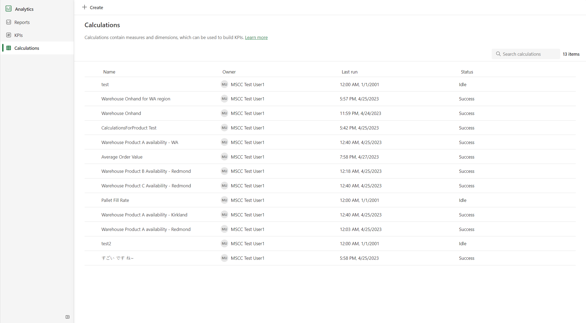
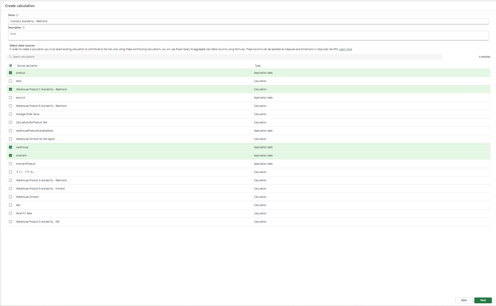
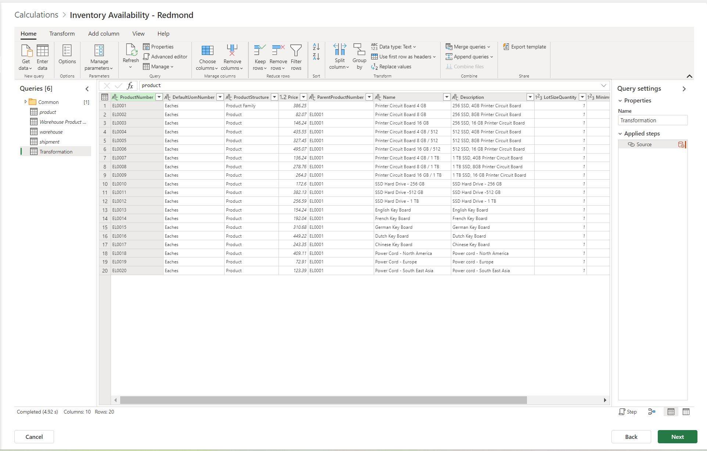
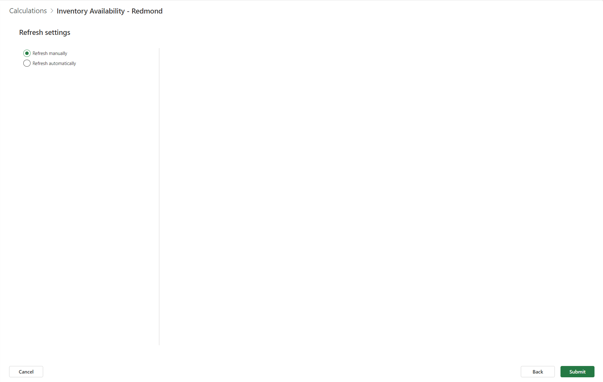

# Create and use calculations

[!INCLUDE[banner](../includes/banner.md)]

Calculations are data tables that contain measures and dimensions. Calculations can be used to create key performance indicators (KPIs).

## Create a calculation

To create a calculation, follow these steps.

1. Sign in to Microsoft Supply Chain Center, and then select **Analytics**.
1. On the navigation pane, select **Calculations**.

    

1. Select **Create** to open the calculation creation wizard.
1. Select one or more data sources to use for the calculation. Ingested entities show a value of **Application data** in the **Type** column. Previously created calculations show a value of **Calculation** in the **Type** column.

    

1. When you've finished selecting the required data sources, select **Next**.
1. The selected data sources are formed into a Power Query editor. The **Queries** pane on the left shows the queries that are called as the data sources are used. You can transform the data in any of these queries, but be sure to include the data that will be used as a measure in the **Transformation** query. By default, the **Transformation** query includes the same data as the top data source that you selected.

    

1. When you've finished, select **Next**.
1. Select the cadence for refreshing the calculation. Select **Refresh manually** to refresh the data once. Select **Refresh automatically** to refresh the data on a recurring basis.

    

1. Select **Submit** to create the calculation.

## View calculation details

On the **Calculations** page, you can view the details of a calculation:

- **Owner** – The user who created the calculation.
- **Last run** – The last time that the data refresh was run for the calculation.
- **Status** – The status of the latest data refresh of the calculation. The **Success** status indicates the data refresh was successfully completed. The **Idle** status indicates that the last data refresh wasn't successfully completed.

To view details for a calculation, select its name.

- In a calculation, you can find the underlying queries that are used.
- In **Dependencies**, you can find the underlying data sources that the calculation depends on. You can also find any resources that depend on the calculation that you're viewing.

## Manage an existing calculation

Currently, you can't edit an existing calculation. To manage an existing calculation, select the **More actions** button next to the calculation name, and then select an action. The following actions can be performed on a calculation:

- **Clone** – Create a copy of the calculation, and change any underlying data transformation by using Power Query.
- **Rename** – Change the name of the calculation.
- **Refresh** – Set a one-time data refresh of the calculation.
- **Delete** – Remove the calculation.

## Best practices

While you work with calculations, observe the following best practices:

- **Include measure and date columns in your calculation.** It's important that you include both a measure (or aggregation) column and a date column. The measure column should represent the data that you want to track, such as revenue or customer satisfaction. The date column should represent the period that you want to track the data over, such as days, weeks, or months.
- **Sort date columns in descending order.** To ensure that your KPI accurately reflects historical trends, sort date columns in descending order. In this way, the most recent data is shown first, so that you can quickly identify any changes or trends over time.
- **Refresh calculations.** Calculations that are used in KPIs should be successfully refreshed to ensure that they're up to date and accurate.
- **Use the appropriate level of aggregation.** When you create calculations to use in KPIs, it's important that you measure the smallest possible unit to a high level of aggregation. Therefore, you should create calculations that represent the data at different levels, from the most granular (such as individual transactions) to the most aggregated (such as total revenue). For example, if you want to track revenue growth for a company by region, create separate calculations for each region, and create a calculation for the company as a whole. The most aggregated level can be used in parent KPIs, and the most granular level can be used in children KPIs.
