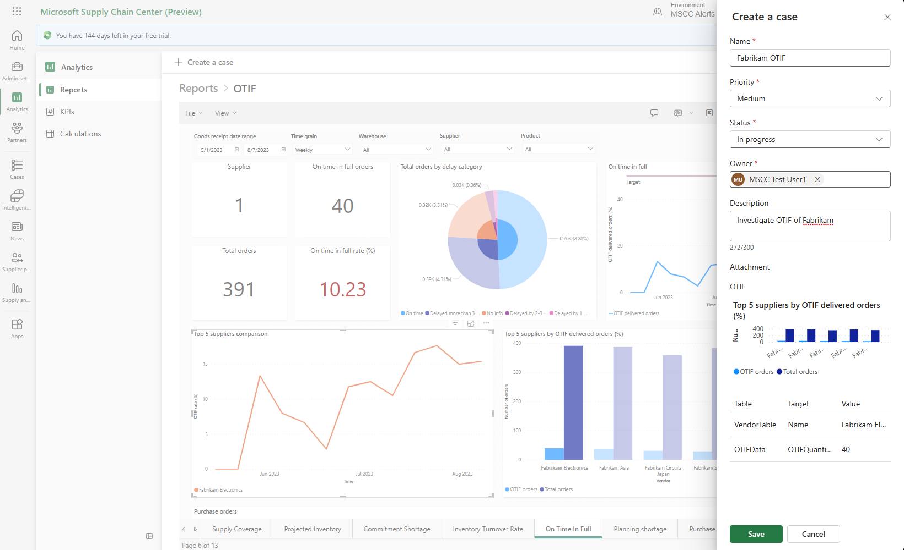
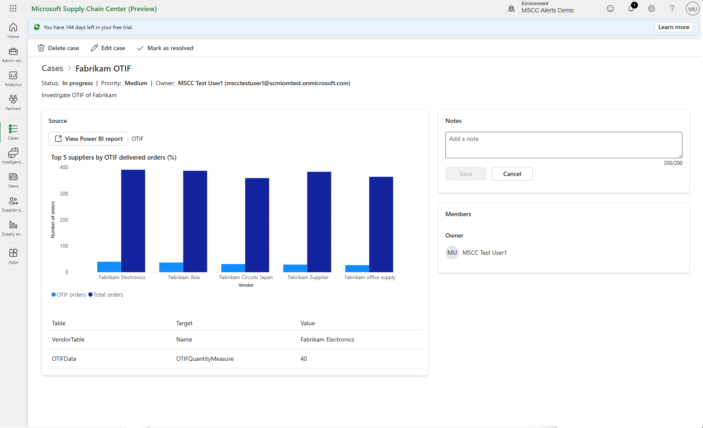

# Mitigation cases

Cases is a module within Microsoft Supply Chain Center to capture risks and document their mitigation for future use. While cases can also be created from outside the Cases module, already created cases can be viewed and updated from within the module.

## Create a case

There are multiple entry points to create a case within Supply Chain Center. Regardless of entry point, a sidebar with a form appears. Use the form to describe the risk and click "Save" to create the case and close the sidebar.

### Analytics reports

Cases can be created directly from custom reports in the Analytics section of Supply Chain Center. To create a case from a single chart, first select a data point on that chart then click "Create a case" in the top left. Click "Create a case" in the top left without selecting a data point to create a case from the entire report. Creating cases from Analytics reports links that case to the chart or report it was sourced from.

### From scratch

Creating a generic case from scratch can be done through the Cases module. After selecting the Cases module, click "New case" in the top left. Because these cases lacked the context of a risk, they won't contain a link to the source they were created from.

## View and update a case

Any user can view and update a case. To do so, go to the Cases module to view the table of cases. The cases can be sorted according to the column headers and there is a search bar to search by a case's name. Additionally, select the "Own" tab to only see cases that have been assigned to you.

After sorting and filtering cases, click on the name of a case to view it. Notes to keep track of actions and their progress can be added directly in the Notes tile. To edit the information that was inputted when first creating the case, select "Edit" in the top right. The case sidebar appears again and the information in it, such as the name of the case and owner, can be updated.

