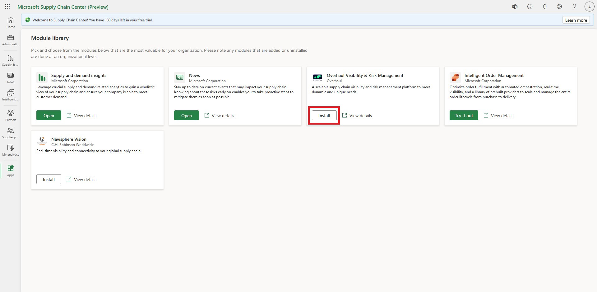
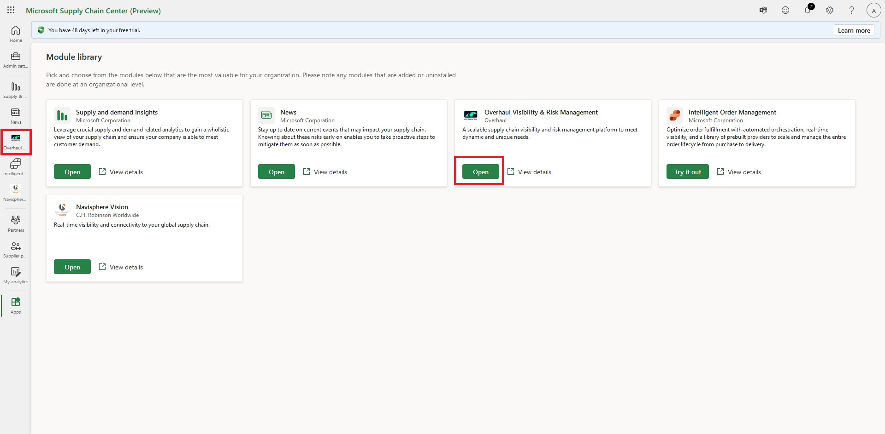
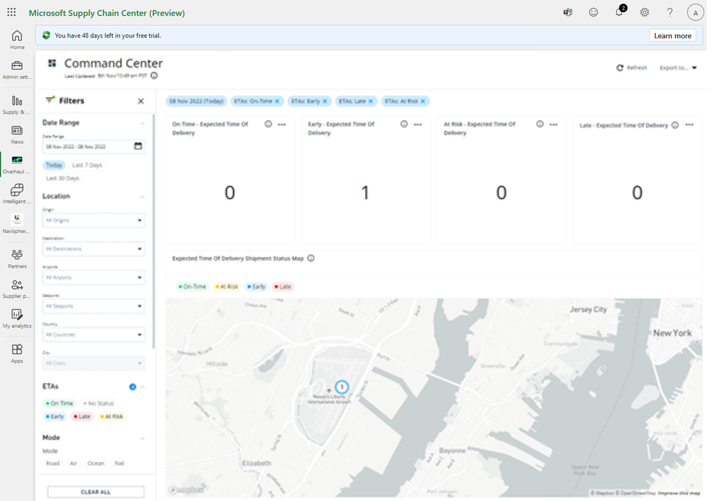

# Install the Overhaul module

This article describes how to set up the Overhaul module within Microsoft Supply Chain Center.

Overhaul is a Software as a Service (SaaS) transportation visibility and risk management platform. It provides data-driven visibility and risk management insights to empower your supply chain. The Overhaul module allows you to use your existing Overhaul credentials to access the Overhaul visibility and risk management solution within Supply Chain Center.

## Prerequisites

To install and successfully log in to the Overhaul module, you must have an existing Overhaul license & account credentials.

To contact Overhaul for more information about obtaining a license, see [Speak with an Overhaul advisor](https://over-haul.com/overhaul-microsoft-supply-chain-center/).

To install the Overhaul module, complete the following procedure.

1. Log in to Supply Chain Center.
2. In the navigation pane, select **Module Library**.

3. From the Overhaul Visibility & Risk Management card, select **Add.**

4. Review the installation instructions and prerequisites, and then select **Continue**. You're redirected to **Microsoft AppSource** to continue installation.

5. In **AppSource** , select **Get it now.**

6. In the pop-up, complete the requested information, and then select **Get it now**. You're redirected to the **Power Platform admin center** where you can select an environment.
7. Select the **Select an environment** dropdown on the right side, and then choose the correct Dataverse environment that you want to install the Overhaul module in.
8. Select both checkboxes next to agree to the **Legal Terms** and **Privacy Statement** items that display after you select the environment.

9. Select **Install**.

NOTE: The installation process can take several minutes. You'll see an installation notification in the top right corner of the Supply Chain Center homepage and the module being installed on the left side.

10. You're redirected to an **Overhaul** page where you'll need to enter your valid login credentials.

> [!Note.]
> You'll need an active license and login credentials to access the Overhaul platform.** _

To contact Overhaul for more information about obtaining a license, see [Speak with an Overhaul advisor](https://over-haul.com/overhaul-microsoft-supply-chain-center/).

11. After you've successfully logged in to your Overhaul account, you'll be redirected back to the Microsoft Supply Chain Center.

When you go to the **Module Library**, you'll notice that the **Add** button on the Overhaul Visibility & Risk Management card has changed to **Open**.

12. To open the Overhaul module, select the **Open** button.

A tab for the installed Overhaul module appears within the left menu, which makes it easier to access the module in the future.

13. Enter your Overhaul account credentials, and then select **Sign In**.
14. After you're signed in, you can see your Overhaul Command Center.

