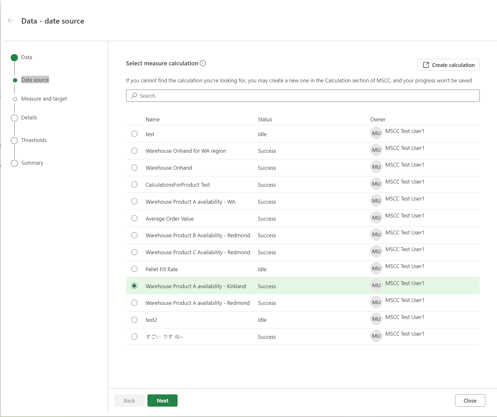
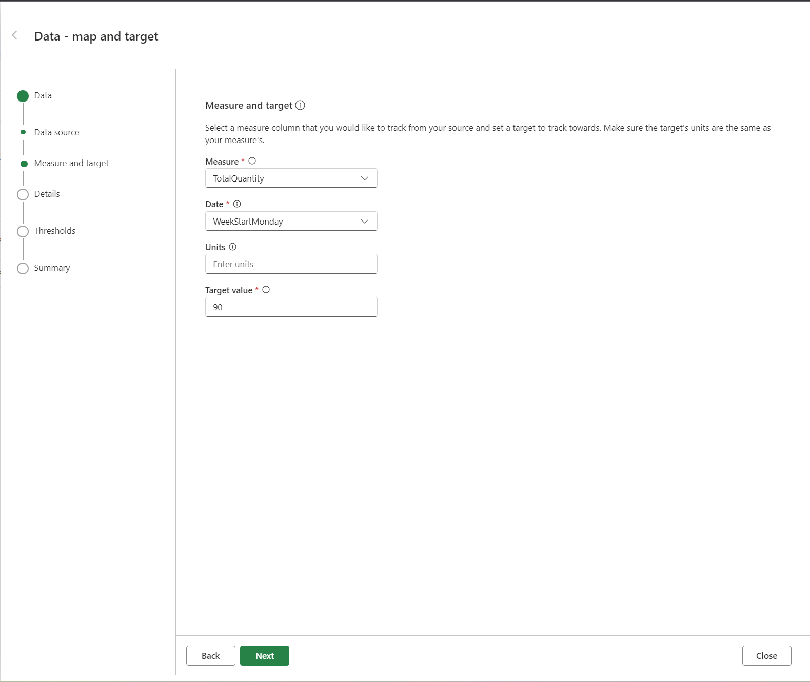
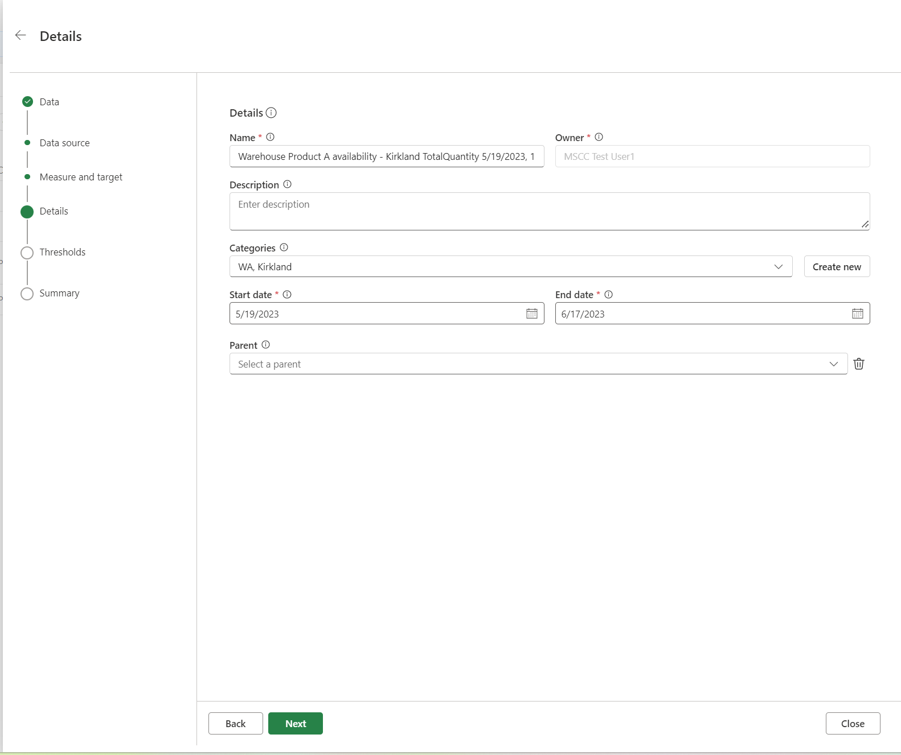
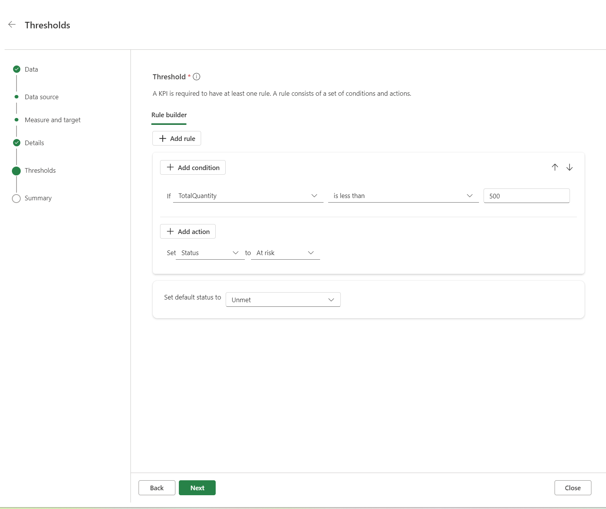

# Create and use KPIs

This article explains how to create and use key performance indicators (KPIs) in Microsoft Supply Chain Center.

## What are KPIs?

KPIs are measurable values that help organizations, teams, or individuals assess their progress toward specific objectives or goals. These quantifiable metrics are used to evaluate the effectiveness of processes, projects, or initiatives, and to track performance over time. The process of managing the use of KPIs includes setting a target (the desired level of performance), tracking progress against that target, and taking any corrective action that is required.

## Create a KPI

> [!IMPORTANT]
> Before you can create a KPI, you must create or import calculations. For more information, see [Create and use calculations](calculations.md).

To create a KPI, follow these steps.

1. Sign in to Microsoft Supply Chain Center, and then select **Analytics**.
1. On the navigation pane, select **KPIs**. 
1. Select **Create** to open the KPI creation wizard.
1. Select the data source that you want to use to measure the KPI. You can select only calculations that were successfully refreshed. To track the KPI, the selected calculations must have date and measure columns. The date column will be used as the time series data that the KPI is tracked over. The measure column is the value that will be used to track the KPI.

    

1. When you've finished, select **Next**.
1. Select the measure and date columns, and the target value of the KPI. The target value represents the desired level of performance or achievement for the KPI and is used to calculate KPI progress.

    You can also specify the units that the KPI should be measured in. For example, you can enter **Lb.**, **KG**, **%**, **USD**, or **EUR**.

    

1. When you've finished, select **Next**.
1. Specify general details for the KPI: the name, description, categories, start date, end date, and parent. 

    - Categories can be used to group KPIs together.
    - The start and end dates represent the period that the KPI is tracked over.
    - If you already have an existing KPI, you can assign it as a parent of the KPI that you're creating. Assignment of a parent is useful for showing the relationship between different KPIs.

    

1. When you've finished, select **Next**.
1. Set the threshold for the KPI. A KPI must have at least one rule. A rule consists of a set of conditions and actions. Actions are performed when a condition is met.

    In addition, you can change the status of the KPI when the rule is met. For example, if you're creating an **On Time In Full** KPI, you can set up a threshold so that when the value is less than 95 percent, the KPI status is set to **At risk** and a Power Automate flow is triggered.

    KPI rules are periodically evaluated, according to the data refresh rate that is set in the **Supply and demand insights** section in **Settings**.

    

1. When you've finished, select **Next**.
1. Review the details of the KPI that you're creating. You can edit any of the information from the previous steps.
1. Select **Submit** to create the KPI.

## Edit or delete an existing KPI

Currently, you can't edit an existing KPI. You can modify the parent and child KPIs that are associated with a KPI.

To delete a KPI, select it, and then select **Delete KPI**.

## View a KPI

On the **KPIs** page, you can view KPIs by their **Name**, **Description**, **Status**, **Value**, **Units**, **Progress**, **Start Date**, **End Date**, **Owner**, and **Categories** values. You can filter by **Status** value by selecting the different status labels at the top of the page.

To view the details of a KPI, select its **Name** value. You can view the KPI's performance over time, its value history, any parent or child KPIs that it's related to, and other details.

## Best practices

The following sections describe the best practices that you should observe when you create calculations and KPIs.

### Best practices for creating calculations for KPIs

- **Include measure and date columns in your calculation.** It's important that you include both a measure (or aggregation) column and a date column. The measure column should represent the data that you want to track, such as revenue or customer satisfaction. The date column should represent the period that you want to track the data over, such as days, weeks, or months.
- **Sort date columns in descending order.** To ensure that your KPI accurately reflects historical trends, sort date columns in descending order. In this way, the most recent data is shown first, so that you can quickly identify any changes or trends over time.
- **Refresh calculations.** Calculations that are used in KPIs should be successfully refreshed to ensure that they're up to date and accurate.
- **Use the appropriate level of aggregation.** When you create calculations to use in KPIs, it's important that you measure the smallest possible unit to a high level of aggregation. Therefore, you should create calculations that represent the data at different levels, from the most granular (such as individual transactions) to the most aggregated (such as total revenue). For example, if you want to track revenue growth for a company by region, create separate calculations for each region, and create a calculation for the company as a whole. The most aggregated level can be used in parent KPIs, and the most granular level can be used in children KPIs.

### Best practices for creating KPIs

- **Use a calculation that meets all best practices.** To ensure that your KPI accurately reflects the data that you want to track, use a calculation that meets all the best practices that are described in the previous section.
- **Consider the start date when you evaluate progress.** When you evaluate progress for a KPI, remember that the progress is based on the start date of the KPI and doesn't consider historical data.
- **A KPI target can't have a negative value.**
- **Remember that child KPIs don't roll up to parent KPIs.** Each KPI tracks its own progress and doesn't roll up the progress from its child KPIs. Therefore, you can track progress at different levels of aggregation and identify areas that might require further analysis.
