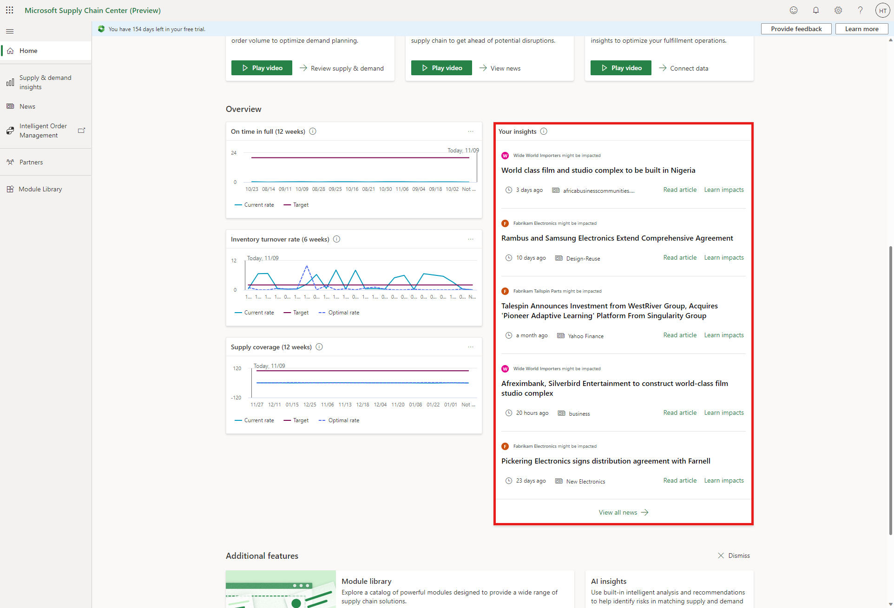
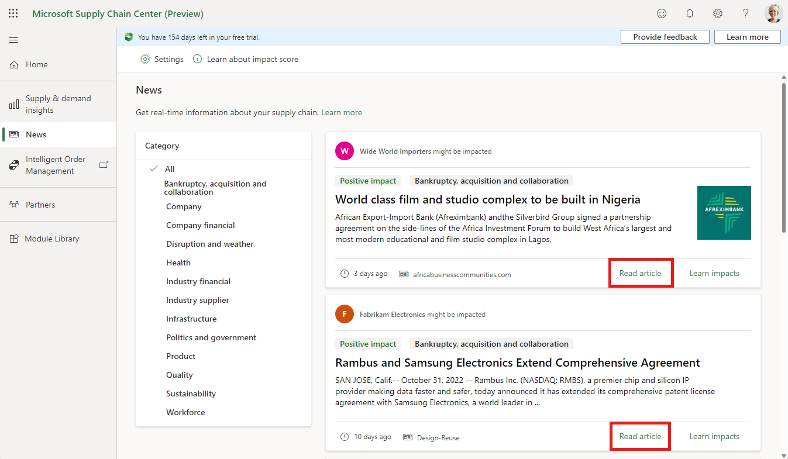
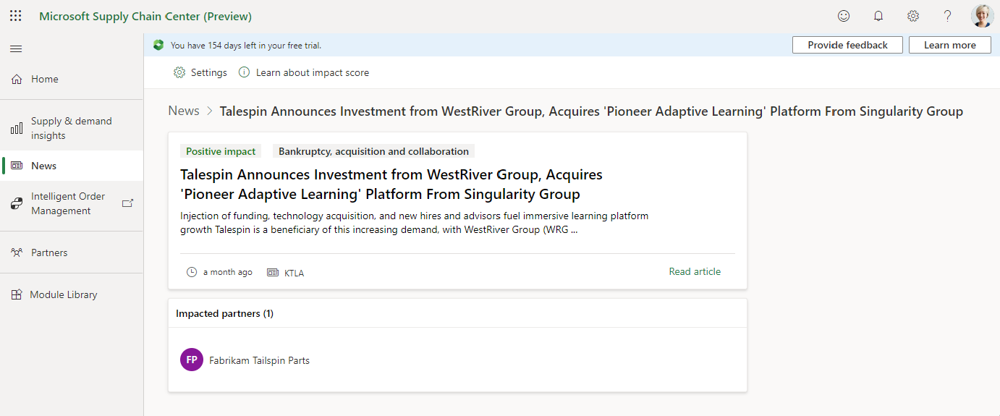
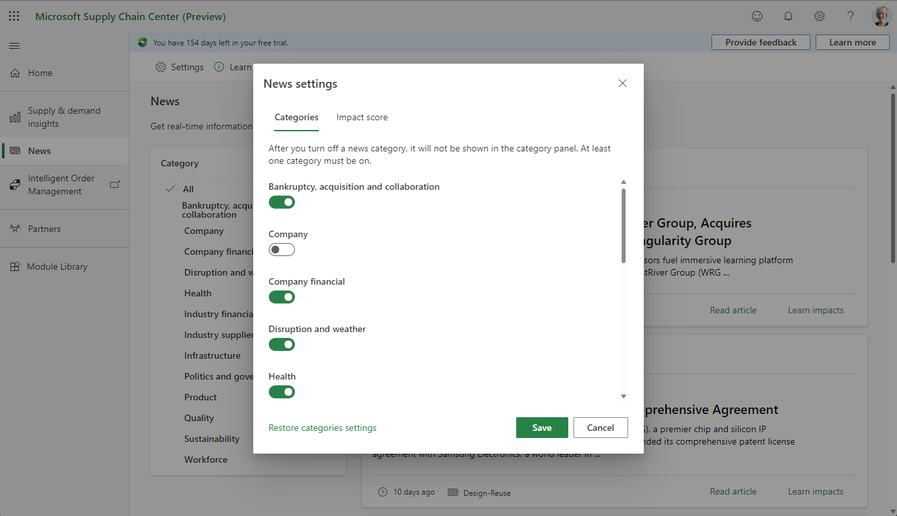

# News

News gathers information about world events, and then presents the news that is relevant to your partner companies to help you identify and respond to external risks. This feature uses world-class artificial intelligence to filter articles by supply chain relevance to make this news topical for your business (and your suppliers).

> [!Video https://www.microsoft.com/en-us/videoplayer/embed/RE5ccYw]

## Prerequisites

News is presented using vendor names that have been ingested to Supply Chain Center.

## Functionality

Supply Chain Center curates recent relevant news articles by using a trained AI model that identifies news that could affect a supply chain. The news articles are then presented as tiles on the **Home** and **News** pages of the application.

If you select **Read article** on a tile, the news story is opened on a new tab.

If you select **Learn impacts** on a tile, a page that is specific to the news article is opened. There, you can see which partners in your supply chain could be affected by the news.

>[!Note]
>Larger companies are more likely to be prominent in the news than smaller companies. As a result, certain sources of risks from smaller partner companies may not be highlighted if they are not in the news.

Each news article is assigned an impact score and a category by the same AI model that sorts the news articles by relevance. The impact score and category definitions are learned from past news articles that were labeled with the correct impact and category. The AI model learns patterns from the sentiment and content of these labeled articles to make predictions for new articles. You can filter on these two characteristics on the **News** page. The news articles can be filtered by category by selecting an individual category on the left navigation. Additionally, multiple categories can be toggled off or on within the settings found on the **News** page.

## Impact score definitions

Each article will automatically be assigned one of the following three impact labels.

- **Immediate impact**: Contains news that directly negatively impacts companies currently in your supply chain.
- **Future impact**: Contains news that has the potential to negatively impact companies in your supply chain at some point in the future.
- **Positive impact**: Contains news that is positive about companies in your supply chain and contain supply chain relevant content.

## Category definitions

All news articles will be assigned one of the following categories:

- **Bankruptcy, acquisition, and collaboration**: Contains information about mergers and acquisitions, bankruptcy, or new or reduced collaborations with other companies or suppliers.
- **Company**: Contains information relevant to the company, such as changes in leadership or important personnel, new investment areas, or awards.
- **Company financial**: Contains information about the growth and financial outlook of an individual company.
- **Disruption and weather**: Contains information about events causing direct supply disruption, such as factory fires, explosions, leaks, Suez Canal blockage, or natural disasters such as forest fires or hurricanes.
- **Health**: Contains information about human and animal epidemics and pandemics, such as COVID-19, Ebola, or H1N1.
- **Industry financial**: Contains information that focuses on the growth or financial outlook of an entire industry.
- **Industry supplier**: Contains information about other suppliers in the same industry, such as top supplier lists or general supplier risk articles.
- **Infrastructure**: Contains information about general infrastructure improvements that could benefit a specific supplier.
- **Politics and government**: Contains information such as government investigations, government collaborations, discounts/deals, lobbying, litigation, or regulations.
- **Product**: Contains information about new or old products of the company, such as new technologies used in existing products or removal of product lines.
- **Quality**: Contains information about supplier quality or quality control issues.
- **Sustainability**: Contains information such as new or existing sustainability efforts or environmental impacts.
- **Workforce**: Contains information affecting employees, such as strikes or workplace conditions.

### Learn More

To learn more about how the model works, please see our two blog posts:

[Supply Chain News for your Digital Twin - Microsoft Research](https://www.microsoft.com/research/group/dynamics-insights-apps-artificial-intelligence-machine-learning/articles/supply-chain-news-for-your-digital-twin/)

[Supply Chain News: Impact and Categories - Microsoft Research](https://www.microsoft.com/research/group/dynamics-insights-apps-artificial-intelligence-machine-learning/articles/supply-chain-news-impact-and-categories/)

