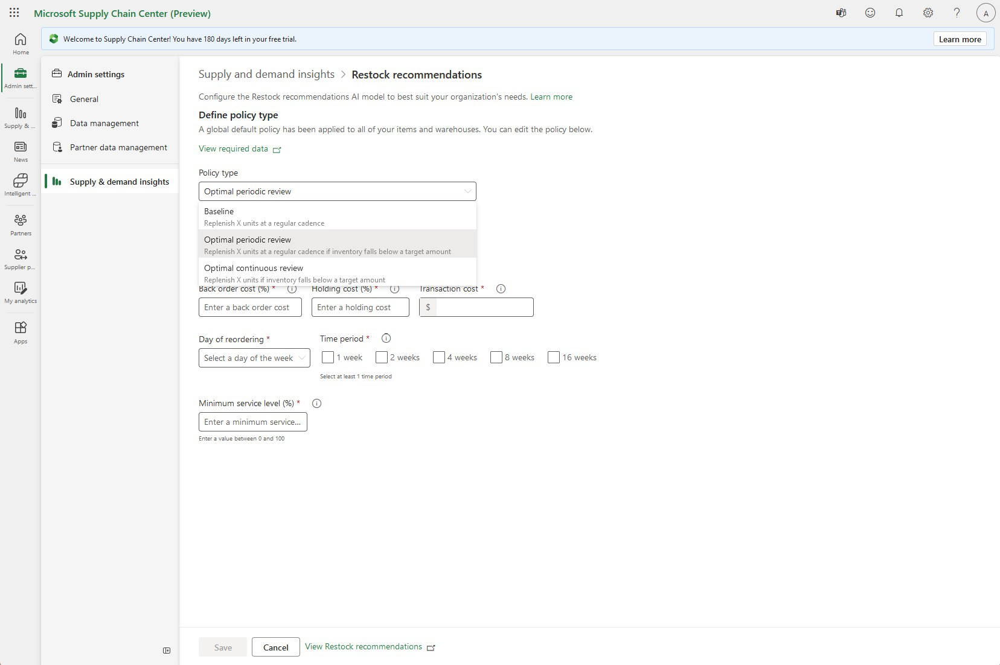

# Configure and review restock recommendations
This article explains how to configure and review stock replenishment recommendations by using the **Restock recommendations** model. These recommendations help you meet target service levels by recommending when and how much stock you should reorder for a given item and warehouse location. You should always review the final Restock recommendations before making replenishment decisions so you can include factors that may be outside of the Restock recommendations model.

>[!Video https://www.microsoft.com/en-us/videoplayer/embed/RE5cisA]

## Prerequisites
Before you can use **Restock recommendations**, data for the following entities must be ingested into Microsoft Supply Chain Center:

- Build Plan
- Item
- Vendor Item Lead Time
- Shipment
- Shipment Item
- Warehouse Item Available Stock

## Configure Restock recommendations
Restock recommendations includes default settings for stock replenishment. However, you can optionally adjust the policy type and the configuration settings for that policy type.

## Policy type
Restock recommendations provides the following policy types:

- Baseline – This policy type requires that you select a time period for reordering, the day when stock is reordered, and the target service level (as a percentage). Use this policy type if you don't have cost information, and your organization typically orders inventory on a regular cadence.
- Optimal periodic review – This policy type requires information for Back order, Holding, and Transaction costs. You must also select a set of time periods to consider for reordering, a minimum service level percentage, and the day when stock is reordered. Use this policy type if your organization typically orders inventory on a regular cadence.
- Optimal continuous review – This policy type requires information for Back order, Holding, and Transaction costs. You must also select a minimum service level. Use this policy type if your organization typically orders inventory whenever inventory is low.

When **Restock recommendations** is used, a data quality check is run on the data. It checks for the following attributes:

- Data has been ingested for required entities and attributes.
- All items in Build Plan are captured in the following entities:
  - Item
  - Vendor Item Lead Time
  - Warehouse Available Stock
- Key performance indicators (KPIs) can be computed.
- Build Plan contains entries for all scoped products and locations at a daily granularity for all dates.
- Item costs are provided for cost-optimal policy types.

To configure Restock recommendations, complete the following procedure:

1. In the navigation pane, select **Restock recommendations**.
1. In the **Policy type** field, select a policy type.
1. Configure the policy by selecting the appropriate attributes for the selected policy type.
   1. **Baseline** needs Time Period, Day of Reordering, and Service Level
   1. **Optimal Periodic Review** needs Back order cost, Holding cost, Transaction Cost, Day of reordering, Time period, and Minimum Service Level
   1. **Optimal Continuous Review** needs Back order cost, Holding cost, Transaction Cost, and Minimum Service Level
1.elect **Save**.

**Back order** cost includes penalties from late orders and lost sales and is a percentage of the total cost per unit.

**Holding costs** include storage of inventory and insurance and is a percentage of the total cost per unit.

**Transaction costs** include inbound and last mile costs and is an absolute value per unit.

Target service level is the percentage of orders that you want to target filling on time and is in a range from 0 to 100.

**Minimum service leve**l is the minimum percentage of orders that you want to target filling on time under cost optimal policy types and is in a range from 0 to 100.

**Day of Reordering** and **Time Period** are used for specifying when you would like to reorder stock, and the recommendations will give a quantity based on this time schedule.

### Review recommendation status and results

In the **Supply & demand** module, the stock replenishment recommendations that Restock recommendations identifies are shown on the **Restock recommendations** tab of the **Inventory Turnover rate, Supply Coverage**, and **Projected inventory** pages.

The Restock recommendations results per item grid on the Restock recommendations tab shows details for each product and site:

- **ItemSku** – The name of the product or item.
- **WarehouseId/WarehouseName** – The warehouse location of the product.
- **PolicyType** – Designates the re-order policy type, can be either:
  - **RS** – A baseline or optimal periodic policy type where inventory is reordered on a time basis.
  - **sQ** – An optimal continuous policy type where inventory is replenished when falling below a threshold level.
- **Reorder Point Quantity \[Optimal continuous policy only\]** – In a continuous policy, inventory should be reordered whenever inventory levels fall below the reorder point quantity.
- **Reorder Quantity \[Optimal continuous policy only\]** – In a continuous policy, a reorder should be for the exact reorder quantity.
- **Review Period \[Optimal periodic/baseline policy only\]** – For periodic policies the review period sets how often inventory should be reordered, in weeks.
- **Order Up-To Level \[Optimal periodic/baseline policy only\]** – For periodic policies, an order should be placed to replenish total inventory (on-hand and in-transit) up to the order up-to level.
- **Safety Stock** – For contextual purposes, safety stock indicates how much of the inventory kept on-hand with the recommended policy is for the purposes of absorbing demand variability.

In some cases, the Order Up-To Level or Reorder Quantity recommendations will be 0. This occurs when **Restock recommendations** cannot make a reliable recommendation for reasons including sparse and/or unpredictable demand, incomplete demand data for the evaluation period, long item lead times, and items for which expected holding costs exceed backorder costs and a “Make To Order” inventory strategy may be a better option.

The **Inventory turnover rate** page contains a "learn more" link. Select this link to open a side pane that contains answers to some common questions about how the stock replenishment recommendations work.

To review recommendation status and results, complete the following procedure:

1. In the navigation pane, select **Supply & demand**.
1. Select **Supply & demand mismatch**.
1. Select **Inventory turnover rate** or **Supply Coverage**.
1. Select the **Restock recommendations** tab.

EOF