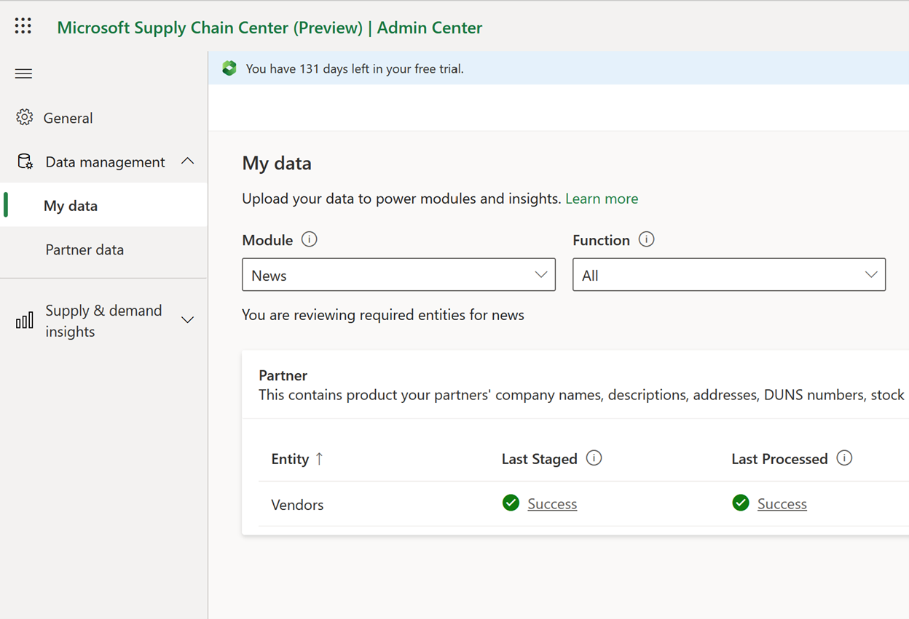
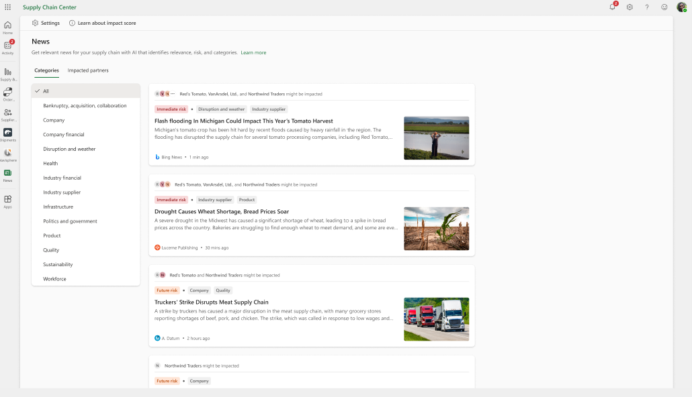
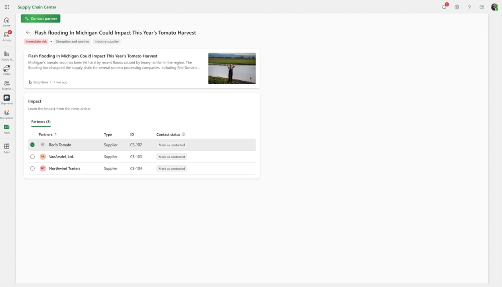
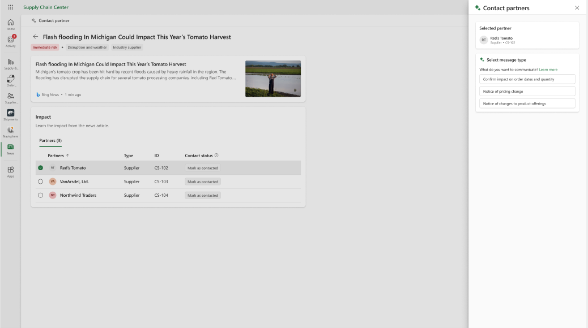
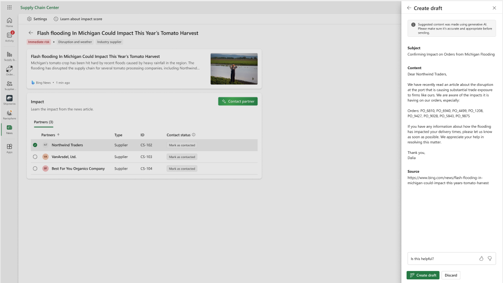

--- 

title: Supplier News Communication
description: This article provides information about Microsoft Supply Chain Center's supplier news communication capability.
author: algiddin
ms.author: algiddin
ms.reviewer: johnmichalak 
ms.service: supply-chain-center 
ms.topic: conceptual 
ms.date: 03/16/2023
ms.custom: bap-template 

--- 

# Supplier News Communication

Supplier news communication drafts e-mails to supply chain vendors based on a user-selected topic and news article. If the topic is to follow-up on purchase orders, then any open purchase order Ids with that vendor are included in the mail. Supplier news communication uses generative AI to create the draft e-mail and subject line.

## Prerequisites

To use Supplier news communication, the **News** module must be installed. For more information, see [News](news.md) 

## Functionality

To get started with Supplier news communication, you need to add vendors using **Data management** \> **My data** in the **Admin Center** of Microsoft Supply Chain Center. 

 

After your vendors are added, you can see news articles about them in the **News** feed. 

 

You can select an article to view the detail page. In the **Impact** section on the detail page, you can select a **Partner** to contact.  

 

Then, select a message type for what you want to communicate to the partner. 

 

Finally, you'll see a draft e-mail that you can review and then select **Create draft** to open the mail in your default e-mail client.

 

## What are Supplier news communication’s capabilities? 

Supplier news communication uses text-davinci-003 generative AI model to draft the e-mail. It uses Azure Open AI’s Content Moderator to help validate the response, along with an NGram-based relevance filter to ensure response is on-topic.

## What is Supplier news communication’s intended use?

Use Supplier news communication to provide a way for business users to follow up with their partners more quickly and efficiently regarding supply chain disruptions that have been reported in the news.

## How was Supplier news communication evaluated? What metrics are used to measure performance?

Supplier news communication was evaluated with human judgment on a random sample of drafted e-mails from a random selection of news articles. To evaluate the system, our metrics included if the e-mail contained false information, if the e-mail content was relevant and actionable, if the e-mail was syntactically correct, if the topic was correctly incorporated into the e-mail, and the amount of editing needed before sending.

## What are the limitations of Supplier news communication? How can users minimize the impact of Proactive supplier collaboration’s limitations when using it?

Supplier news communication today only supports drafting e-mails in the English language. The e-mail draft is generated one time, and there isn't support for editing the draft. As we aren't able to test every possible news situation, it's possible some generated e-mails may be of lower quality than the e-mails that we tested. This can be mitigated by always reviewing the draft e-mail before sending.

## What operational factors and settings allow for effective and responsible use of Supplier news communication?

The selection you make for the news article you want to draft an e-mail about and the topic of the e-mail, will have significant influence on the generated e-mail. The generated e-mail should mention the impact on the supply chain from the news article and ask the partner about the selected topic.

## Troubleshooting

You can edit your default **mail:to** client in your computer settings. If it's not working for you in Chrome, you can go to **chrome://settings/handlers** and allow sites to handle protocols. Then go to your mail client and allow it to handle mails.

## Learn More

Link to future blog post (WIP)
