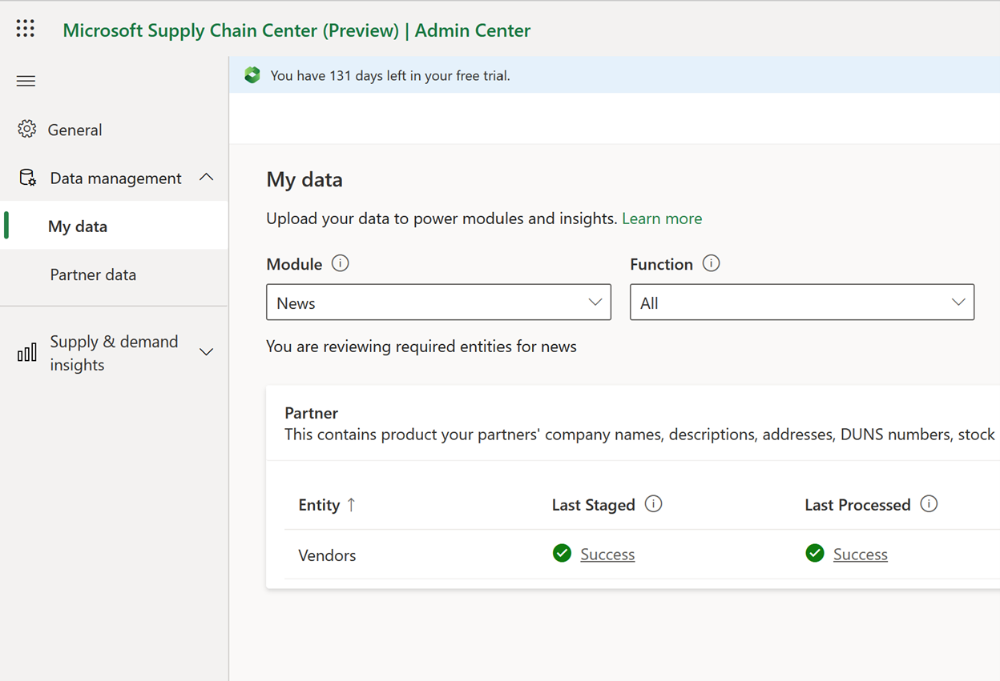
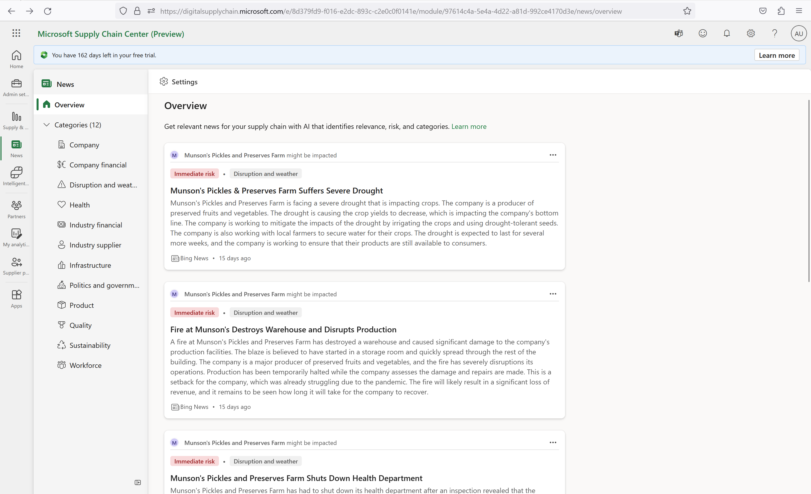
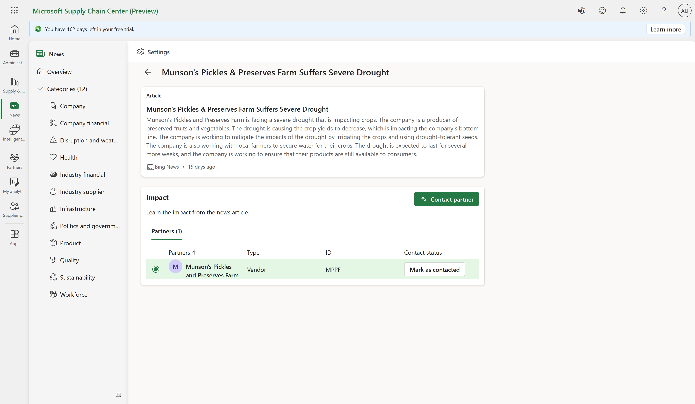
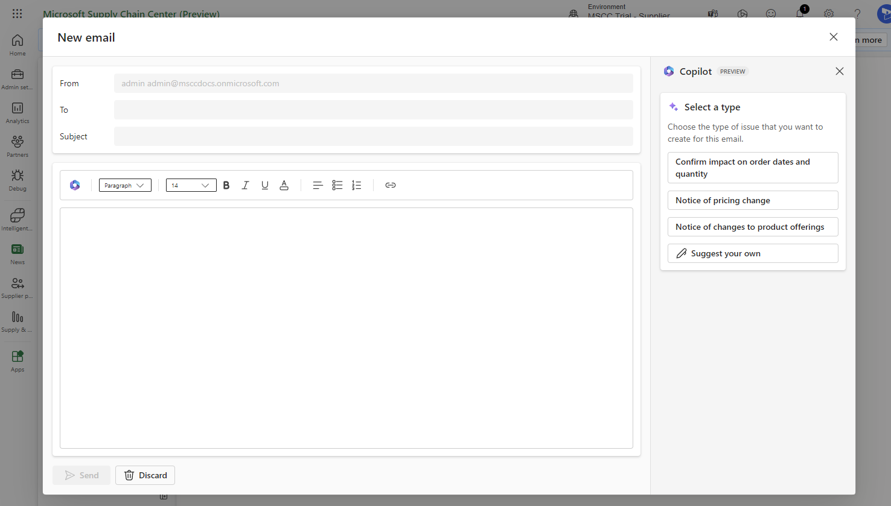
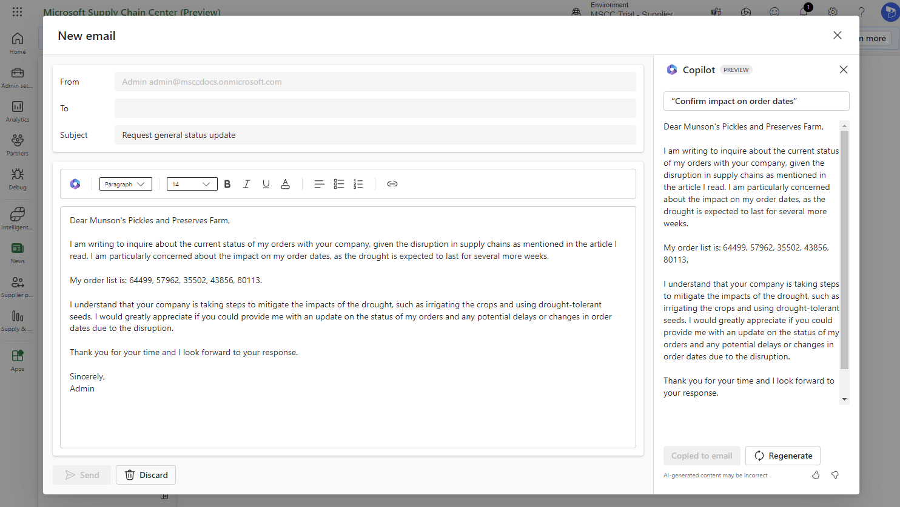

--- 

title: Supplier news communication
description: This article provides information about Microsoft Supply Chain Center's Supplier news communication capability.
author: algiddin
ms.author: algiddin
ms.reviewer: johnmichalak 
ms.service: supply-chain-center 
ms.topic: conceptual 
ms.date: 03/16/2023
ms.custom: bap-template 

--- 

# Supplier news communication

Supplier news communication generates draft emails to supply chain vendors, based on user-selected topics and news articles. For example, if the topic is follow-up about purchase orders, any open purchase order IDs for that vendor are included in the email. Supplier news communication uses generative AI to create the draft email and the subject line.

## Prerequisites

Before you can use Supplier news communication, the **News** module must be installed. For more information, see [News](news.md).

## Functionality

To get started with Supplier news communication, you must add vendors at [**Data management**](../administer/ingest-data.md) \> **My data** in the Microsoft Supply Chain Center Admin Center. Make sure that **News** is selected in the **Module** field.

After your vendors are added (successfully staged and processed), you can view news articles about them in the **News** feed.

You can select an article to view the details page for it. In the **Impact** section on the details page, the grid shows a list of partners that are affected, and gives the type, ID, and contact status for each.

To contact a partner, select it in the grid, and then select **Contact partner** at the top of the page.

Next, in the **Contact partner** dialog box that appears on the right side of the page, select a message type that corresponds to the information that you want to communicate to the partner.

Finally, in the **Create draft** dialog box, review the draft email that's shown. At the bottom of the dialog box, notice that there's an option to provide thumbs-up or thumbs-down feedback. There are also buttons for creating and discarding the current draft email. If you're satisfied with the draft email, select **Create draft** to open the email in your default email client.

## How do I get access?
Sign up for a preview [here](https://aka.ms/AIwaitlist).

## What are Supplier news communication's capabilities?

Supplier news communication uses a text-davinci-003 generative AI model to draft the e-mail. It uses Azure Open AI's Content Moderator to help validate the response, and an NGram-based relevance filter to ensure that the response is on topic. It takes as input the title and snippet from the news article, the user-selected topic, and up to five upcoming open purchase orders to make sure the generated e-mail includes the relevant business context.

## What is Supplier news communication's intended use?

Use Supplier news communication to enable business users to follow up with their partners more quickly and efficiently about supply chain disruptions that have been reported in the news.

## How was Supplier news communication evaluated? What metrics were used to measure performance?

Supplier news communication was evaluated through human judgment on a random sample of drafted emails from a random selection of news articles. Here are some of the metrics that were used to evaluate the system's performance:

- Does the email contain false information?
- Is the email content relevant and actionable?
- Is the email syntactically correct?
- Was the topic correctly incorporated into the email?
- How much editing was required before the email could be sent?

## What are Supplier news communication's limitations? How can users minimize the impact of those limitations when they use Supplier news communication?

Supplier news communication currently supports drafting emails only in the English language. The draft email is generated one time, and there isn't support for editing it. Because we can't test every possible news situation, some generated emails might be of lower quality than the emails that we tested. You can mitigate this limitation by reviewing every draft email before you send it.

## What operational factors and settings allow for effective and responsible use of Supplier news communication?

The news article that you select to draft an email about, and the topic of the email, will significantly influence the generated email. The generated email should mention the impact that the news article will have on the supply chain, and should ask the partner about the selected topic.

## What data has Supplier News Communication been trained on? 

The text-davinci-003 generative AI model has been trained on data on the internet with billions of parameters for tuning. It doesn’t have access to the internet, meaning that data can be stale. While we'e mitigating incorrect information with our content moderation checks, it's possible that the generated e-mail may contain false information.

## Does Supplier News Communication produce perfect emails?

It's not guaranteed to produce perfect e-mails. While we do have checks in place to reduce the frequency of offensive or false information in e-mails, you should always review the e-mail before sending.

## How does a customer get the most out of Supplier News Communication? 

A customer can get the most out of Supplier News Communication by selecting topics that are relevant for them and always reviewing the generated e-mail.

## Does Supplier News Communication produce offensive content?

While we do have checks in place to reduce the likelihood of the e-mail containing offensive content, it's not guaranteed so you should always review the e-mail before sending.

## Troubleshooting

You can edit the default **mail:to** client in your computer settings. If Supplier news communication doesn't work for you in the Google Chrome browser, go to **chrome://settings/handlers**, and enable sites to handle protocols. Then go to your email client, and enable it to handle emails.
