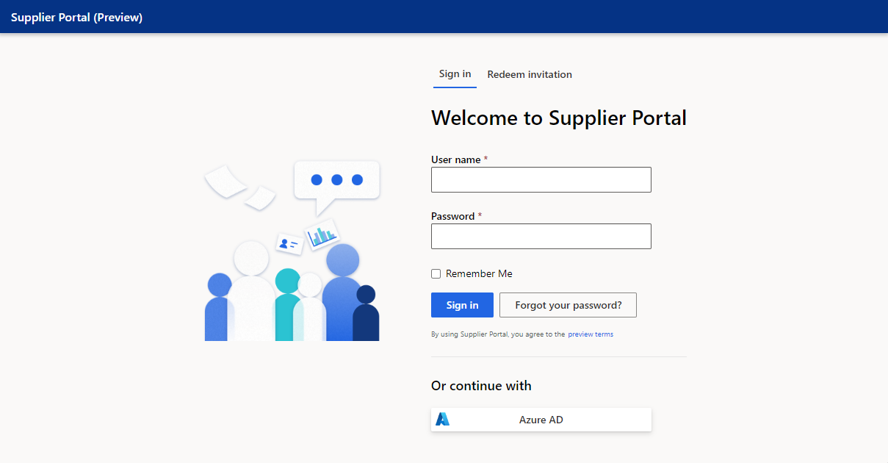

# Supplier portal (for suppliers)

The Supplier portal is a self-service application that brings a holistic approach to supplier management by removing communication barriers between suppliers and their customers. It’s a next-generation application that empowers you to collaborate with your supply chain partners in real time. Visibility into the health of your supply chain is enhanced by bringing together data from your own systems and integrating it with data that comes from your partners. The Supplier portal helps suppliers and their customers share and review data, inform each other, and make changes on the fly.

## Supplier registration

Self-service prospective supplier registration lets you register your interest in establishing a business relationship with a buying company. If the buying company wants to enter into a relationship with you, it will send you a request to register.

- **Option 1**: Your customer may manually send you the username and password with the link to log in to their supplier portal.
- **Option 2**: To register, use the link to the supplier registration page and the invitation code sent in the registration notification. This information is verified against existing records to ensure that duplicate registration information isn't recorded.

### Automated Email invitation received

If your customer goes with option 2, then you will receive an email that contains a link to their supplier portal where an invitation code will automatically be populated. Click **Register** and enter your information to create an account for your customer's supplier portal.

## Responding to a collaboration request

When a business partner requests updated data from you, you'll receive an email with a link to supplier portal and instructions on how to log in and respond to the collaboration request. After you log into the Supplier portal, you can see the status for any new and old requests before clicking on the one you want to respond to.

When responding to a collaboration request, first download a csv file with data for that request. After you provide your production schedule and purchase order commitments, you can upload the csv file corresponding to the collaboration request. After the upload is complete, data validation occurs during the upload. If there are any errors, you're notified and provided an opportunity to correct the errors and the file again. The collaboration request status is set to Complete after processing is successful. 

### Supplier production schedule

When a business partner shares the forecast with you through the Supplier portal, download the csv file they sent to view the forecast data and respond with production schedules and projected inventory by uploading a completed csv file for the collaboration request. Data validation occurs during the upload. If there are any errors, you're notified and provided an opportunity to correct the errors and the file again. The collaboration request status is set to Complete after processing is successful. You can’t upload another file on the same collaboration request if an upload is submitted successfully.

### Supplier purchase order commit

When a business partner shares purchase order information with you through the Supplier portal, download the csv file they sent to view the purchase order data and respond with the acknowledgment, commit date, and commit quantity for each purchase order line by uploading a completed csv file for the collaboration request. Data validation occurs during the upload. If there are any errors, you're notified and provided an opportunity to correct the errors and the file again. The collaboration request status is set to Complete after processing is successful. You can’t upload another file on the same collaboration request if an uploaded submitted successfully.
