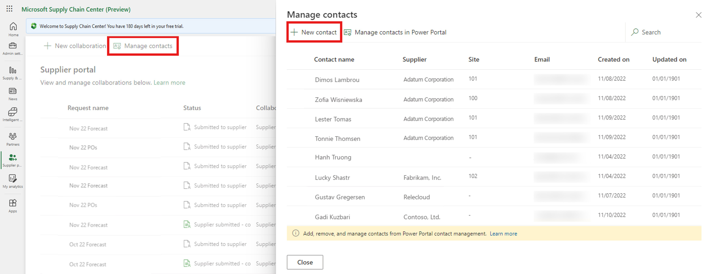
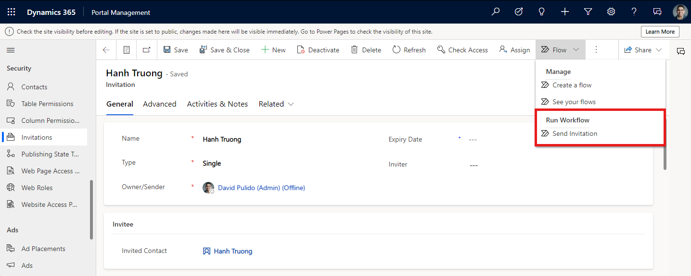
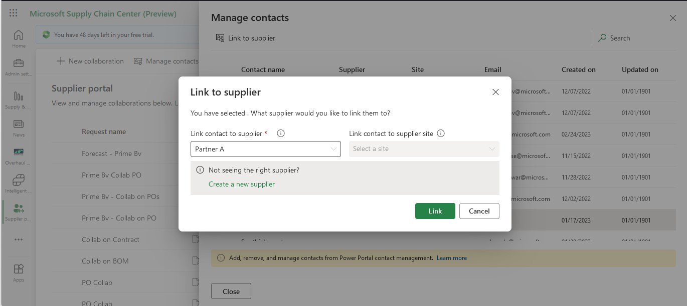
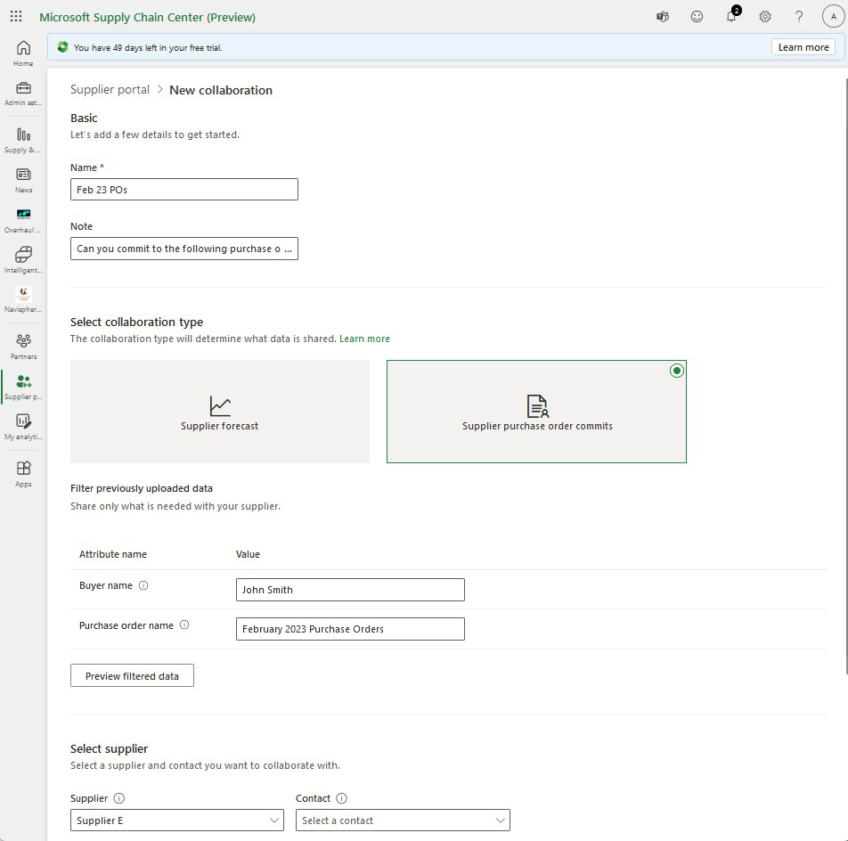
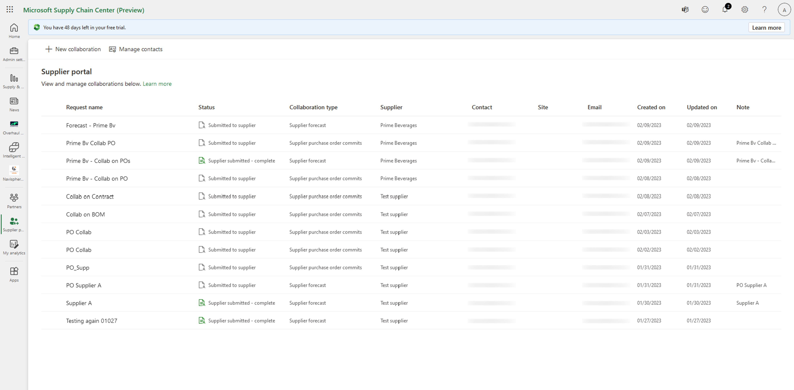

# Supplier portal overview

The Supplier portal structures all supplier communication through a secure portal. Phone calls, faxes, and emails between you and your suppliers waste time, introduce errors, and create latency in the supply chain. By providing a powerful platform for online collaboration, the Supplier portal helps you and your suppliers to become more efficient. Suppliers access the latest information, including forecasts and purchase orders. The rich two-way collaboration lets suppliers submit change requests, ship notices, payments, and profile data. The Supplier portal helps reduce processing costs, provides relief from costly supplier inquiries, and enables a unified collaborative platform for self-service business transactions between you and your suppliers.

We’ve chosen to focus on the following scenarios because they are key concerns across the industry and have emerged top pain points for our customers:

- Centralized forecasting
- View supplier production schedules
- View inventory shortages
- View purchase order commits

## Prerequisites for Supplier portal collaboration

1. Upload data. Ingest customer data from the data source into Microsoft Supply Chain Center.
2. Add a supplier. Create or import a supplier
3. Add a Contact.
4. Create a user name and password, and manually send them to the supplier. Alternatively, create and send an invitation code manually or through email.
5. Link the contact to the supplier in Supply Chain Center.

## Upload data: Data ingestion for supplier forecasts and purchase order commits

Supply Chain Center lets you schedule the automated ingestion of data from a customer’s data source for these two scenarios:

- **Supplier Forecast**: Supplier Forecast Upload Template.xlsx
- **Purchase Order Commits**: Supplier PO Commit Template.xlsx

To receive a copy of the spreadsheet for each scenario, contact Support.

When you select either **Supplier Portal - Forecast** or **Purchase Order Commits**, you can view the entities that are required to ingest data from the data source into Supply Chain Center.

## Add a supplier

The next step is to add a supplier in Supply Chain Center. Go to the **Partners** section and then click **Create new partner** in the top left. This will cause a sidebar to appear where you can enter information to create a new supplier.

## Create contacts for suppliers

Every supplier needs at least one contact. Go to **Supplier portal** and then slect **Manage contacts** at the top of the page. At the top of the **Manage contacts** sidebar which appears, click on **New contact**. 

This will redirect you to Portal Management where you can create contact profiles before rutning to Supply Chain Center to link the contact with the appropriate supplier. In this way, the supplier won’t have to have an Azure AD account to sign up for the Supplier portal and can sign in to a customer’s Power Pages instance by using the invitation link.

## Supplier invitation

After a contact record is created, there are a few ways to enable the contact to register and/or sign in to the portal application. When you create a contact, an invitation link that is sent to the contact includes a link to the Supplier portal and an invitation code that can be used to register.

- **Option 1**: [Set up a user name and password](https://learn.microsoft.com/en-us/power-apps/maker/portals/configure/configure-contacts).  
Users who have access to the Portal Management app can configure a contact with a default user name and password. No registration step is required for this option. 
**Important**: The user name and password (credentials) must be manually sent to the supplier can through a manual communication channel outside Power Pages and the Portal Management app.
- **Option 2**: [Generate an invitation code](https://learn.microsoft.com/en-us/power-apps/maker/portals/configure/invite-contacts#create-invitations-from-portal-management-app). 
**Important**: Invitation code can be sent manually or by configuring the email server.

Users who have access to the Portal Management app can generate invitation codes that can be used to register a user in the portal application. In the invitation, you can include a copy of the credentials and send them (and the URL of the portal application) to someone who is accessing the portal application for the first time. The invitation code must be sent through a communication channel outside Power Pages and the Portal Management app.

Recipients of the invitation can copy the invitation code to your supplier portal application and paste it into the **Invitation code** field on the `**Redeem invitation**` tab in the portal application.

## Send an invitation code via email

The invitation email is sent **only** if both these conditions are met:

1. An email address is associated with the contact record.
2. Server-side synchronization is set up in the [Dataverse environment](https://learn.microsoft.com/en-us/power-platform/admin/set-up-server-side-synchronization-of-email-appointments-contacts-and-tasks).

After you set up the server-side synchronization in the Dataverse environment, you will see that emails are sent when you select **Flow > Send invitation**.

When both the preceding conditions are met and **Send invitation** is selected, a Dynamics 365 process is triggered. This process requires a one-time setup by an IT administrator.

### One-time email setup by an IT administrator

Here's how you can find the process.

1. In the Portal Management app, select the **Settings** button (gear symbol), and then select **Advanced settings** on the menu.

2. Select the drop-down arrow beside the word “Settings” on the header, and then, under **Process Center**, select **Processes**.

3. In the list of processes, find **Send Invitation**.

>[!Important]
> The default application URL that is used in the content of the email (localhost:7500) is incorrect. Therefore, you **must** follow the steps in this section to replace the application URL in the email content before you send any invitations.

### Customize the invitation email

Follow these steps to customize the contents of the invitation email.

1. Open the details page for the **Send Invitation** process by selecting the process name.
2. Select **Deactivate**. Then in the confirmation message box, select **Deactivate**.

3. After the process is deactivated, under the **Create an email to act as an email template** step, select **Set properties**.

4. In the email editor that appears, you can directly add text to the email. You can also add dynamic values from the right pane.

5. When you’ve finished editing the email select **Save and Close**. The email editor is closed, and you’re returned to the details page for the **Send Invitation** process.

6. Where the **Deactivate** button once was, now select **Activate** so that emails can continue to be sent when **Send invitation** is selected in the Portal Management app.

## Link contacts to suppliers in Supply Chain Center

Once a contact has been created and your suppliers have received invitations to sign up to your portal, return to Supply Chain Insight's Supplier portal section and click **Manage contacts** again before selecting the new contact and clicking **Update supplier**. A modal will appear where you can link the contact with their corresponding supplier.

## Send and manage collaboration requests

You can specify which supplier and which contact that is assigned to that supplier you want to collaborate with, based on the scenario (**Supplier Forecast** or **Purchase Order Commits**).

In Supply Chain Center, you can search for and filter on previously uploaded entities to prepare the data to be shared with your supplier. If you haven’t yet uploaded the correct entities, you’re redirected to the data ingestion page.

You can filter on a selected number of attributes in an entity

- **Supplier Forecast** attributes:
  - Forecast Name
  - Plant Name
  - MRP Controller
- **Purchase Order Commits** attributes:
  - Buyer
  - PO Number

Filtering for the preceding attributes uses an exact string match.

Once you complete the collaboration request, your supplier will see it once they log into your supplier portal.

## View the status of collaboration requests

You can view a list of collaboration requests that were sent to each supplier and download responses to those requests, but you can't change them. If changes are required, you can send another collaboration request.  

