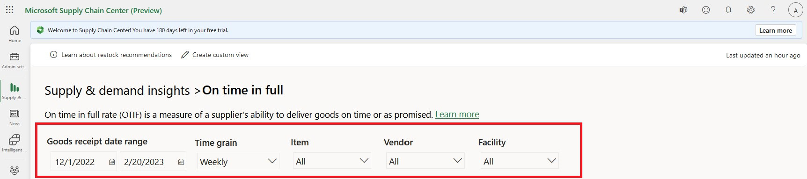
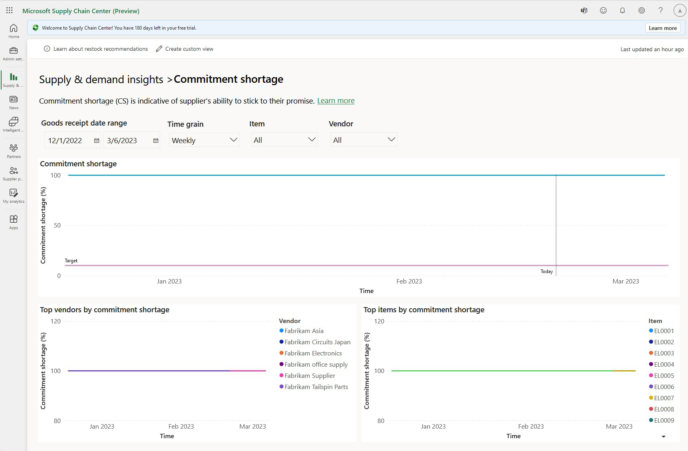

# Supply & demand insights overview

Microsoft Supply Chain Center’s Supply & demand insights home page presents five key performance indicators (KPIs) for inbound orders (procurement). The dashboard helps you monitor the general health of your inbound supply chain, identifies potential risks, and monitors performance.

[!Video https://www.microsoft.com/en-us/videoplayer/embed/RE5azzg]

## Available KPIs

The **On time in full** (**OTIF**) and **Commitment shortage** metrics measure the performance of vendors (suppliers), and the general trend of their performance is visualized in the line chart. **OTIF** shows how often the suppliers are delivering the purchase orders in full and on time as requested.

The **Supply coverage** and **Inventory turnover rate** (**ITR**) metrics focus primarily on inventory levels at a facility or across facilities to help you balance demand and inventory.

**Projected inventory** on the landing page is the aggregated view of supply and demand across all facilities and items, and the general trend that is projected for on-hand stock over demand.

The visualizations on the landing page are aggregations of data across multiple facilities and items by all suppliers.

Users can set target rates or goals for **OTIF**, **Commitment shortage**, **Supply coverage**, and **ITR**. The target settings let users benchmark or measure performance against set goals. For more details about how to set target values for these metrics, see the supply and demand settings in the Admin Center.

Every KPI has their own, visualized report with filters. The filters can be found towards the top of the page and let you better understand your KPI since the report updates accordingly.

### On time in full

**OTIF** is a measure of a supplier’s ability to fulfill an order in full and deliver it on time, based on the original requested delivery date. **OTIF** is a key supply chain metric that is used to measure a supplier’s performance. It’s sometimes referred to as **Perfect Order**.

**OTIF** is calculated as a percentage, by using the following formula:

OTIF = (_All order lines delivered in full and on time in a month_ ÷ _All order lines for that month_) × 100

To determine whether an order is fulfilled in full, the system compares the purchase order quantity against the line item (Purchase Order Line table) with the quantity of all shipments that are in transit and the quantity that has been received against that line item of the Purchase Order.

Determination of on time is calculated by looking at Date Required attribute of a Purchase Order Line entity or table, and then comparing it with the EstimatedDeliveryTimestamp attribute in a shipment that is in transit shipments or comparing it with the ShipmentDeliveryTimestamp attribute for shipments that have been delivered. If either of those dates are beyond the Date Required attribute, then the order was not delivered on time.

Higher OTIF indicates better performance. Target levels above 90% are considered preferred in the current competitive market demands

#### Required entities
To enable OTIF, the following entities or tables are required:
- Item
- Vendors
- Warehouse
- Purchase Order
- Purchase Order Line
- Shipment
- Shipment Item
- Inventory Transaction
- Inventory Transaction Shipment
- Inventory Transaction Unserialized Item

### Inventory turnover rate

**ITR** is a measure of the number of times that goods have turned over relative to their consumption. In other words, it’s a measure, by the company, of the number of days that are required to consume an item that was procured. **ITR** is indicative of the financial investment health of a company.

**ITR** is calculated as the ratio of goods consumed in one month to the average inventory for that month. The following formula is used:

ITR = _Goods sold or consumed in a month_ ÷ _Average inventory for the month_

Consumption of an item during each month is determined from Inventory Transaction entities. Average inventory during each month is determined from the Warehouse Item Available Stock entity.

A higher **ITR** value indicates better inventory management. In general, an **ITR** value above 2 is recommended.

#### Required entities

To enable **ITR**, the following entities are required:

- Item
- Vendors
- Warehouse
- Purchase Order
- Purchase Order Line
- Shipment
- Shipment Item
- Inventory Transaction
- Inventory Transaction Shipment
- Inventory Transaction Unserialized Item
- Warehouse Item Available Stock

### Supply coverage

**Supply coverage** is a measure of supply that meets demand. It’s expressed as a percentage. **Supply coverage** helps you determine whether the on-hand inventory and the expected supply that is in transit for a period will meet the demand for that period. A higher percentage indicates better supply coverage. A lower percentage indicates supply shortfalls and potential risks to meeting demand.

**Supply coverage** is calculated as the ratio of demand and supply. The following formula is used:

Supply coverage = \[(_Sum of all supply for a period_) ÷ (_Sum of all demand for the period_)\] × 100

Supply consists of both on-hand inventory and inventory for shipments that are in transit. On-hand inventory is available in the Warehouse Item Available Stock entity. In-transit shipments are determined by using the Shipment and Shipment Item entities.

Demand is available through the Build Plan entity, which holds the materials requirement planning for the item during the period.

#### Open orders

The **Open orders** report shows all purchase order lines that no shipment has yet been planned for. It includes partially fulfilled orders, backordered orders, and future orders that don’t yet have planned shipments.

#### Shipments in transit

In-transit shipments are shipments that have been shipped by a supplier and are on their way to their final destination. The **Shipments in transit** report shows the original requested delivery date and the actual ship date, together with the original order quantity and the actual delivery quantity.

#### Required entities

To enable **Supply coverage**, the following entities are required:

- Build Plan
- Inventory Transaction
- Inventory Transaction Shipment
- Inventory Transaction Unserialized Item
- Item
- Item Unit Of Measure Conversion
- Location
- Purchase Order
- Purchase Order Line
- Shipment
- Shipment Item
- Shipment Location
- Shipment Route Leg
- Shipment Route Leg Equipment
- Shipment Route Leg Equipment Shipment Item
- Shipment Route Leg IOT
- Vendor
- Vendor Item Leadtime
- Vendor Item Status
- Vendor Location
- Warehouse Item Available Stock

### Commitment shortage

**Commitment shortage** is a measure of a supplier’s forecasted commitments and its ability to meet those commitments. It’s expressed as a percentage. This metric is an important KPI that is used to evaluate a supplier’s commitments.

**Commitment shortage** is calculated by comparing the original promise and the actual delivery. It’s the ratio of the supplier’s forecast that is shared in weekly or daily buckets to the shipments that are received for that period. The following formula is used:

Commitment shortage = (_Quantity not delivered by the supplier for a period_ ÷ _Commitment quantity by the supplier for the period_) × 100

The supplier’s commitment quantity for the period is derived from the ItemCustomerSupplyPlan table.

A low percentage indicates reliable performance (better commitment by the supplier), and a high percentage indicates a potentially unreliable supplier.

#### Required entities

To enable **Commitment shortage**, the following entities are required:

- Item
- Vendors
- Warehouse
- Purchase Order
- Purchase Order Line
- Shipment
- Shipment Item
- Inventory Transaction
- Inventory Transaction Shipment
- Item Customer Supply Plan
- Vendor Location
- Location
- Inventory Transaction Unserialized Item

### Projected inventory

**Projected inventory** is the quantity of an item that is a shortfall or surplus for the on-hand demand. It’s calculated as the difference between supply and firm demand. Supply consists of both what is available on hand and what is expected to be received (in-transit shipments). The following formula is used:

Projected inventory = _On-hand inventory_ + _In-transit shipments_ – _Firm demand_

#### Required entities

To enable **Projected inventory**, the following entities or tables are required:

- Item
- Vendors
- Warehouse
- Purchase Order
- Purchase Order Line
- Shipment
- Shipment Item
- Build Plan

## Restock recommendations

Supply Chain Center has AI-driven optimal inventory. You can access it by selecting **Restock recommendations** at the top of the page,as shown in the following illustration.

**Restock recommendations** shows the reorder quantity by facility and item. It also shows the recommended safety stock for the combination of a facility and an item. You can download this recommendation as an Excel file. For more information, see the Configure and review restock recommendations section.

## Downloading reports

You can download the individual reports as an Excel file by selecting the **More options** button (three dots) in the upper-right corner of a given report and then selecting **Export data** on the menu. Then menu also includes options that let you sort the report in different ways. For example, to sort the report by a specific column, select **Sort by** to get additional sort options.

