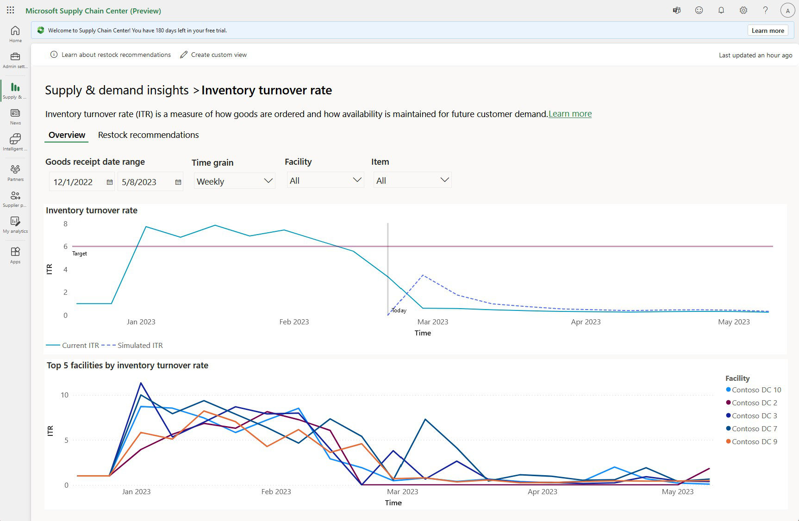
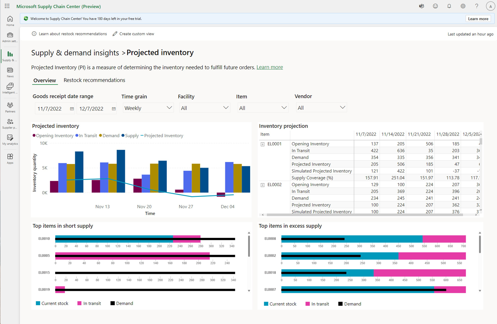
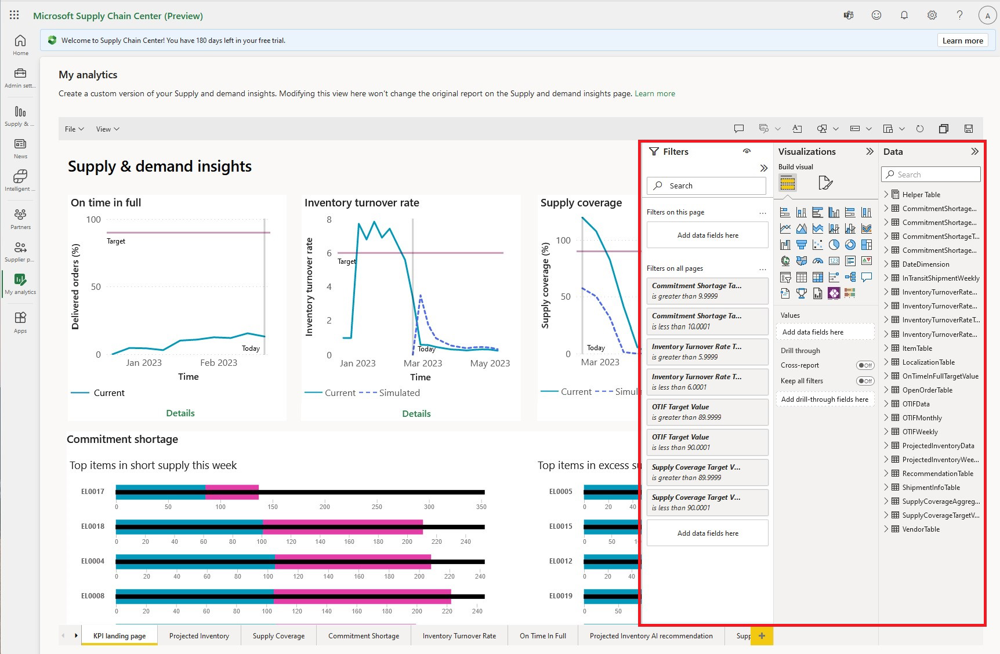
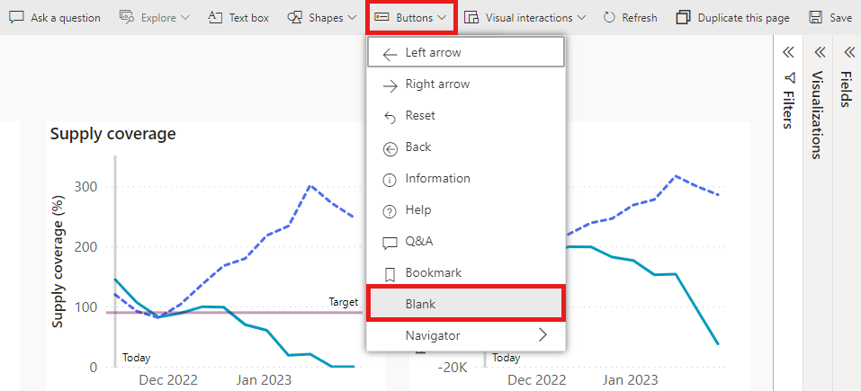
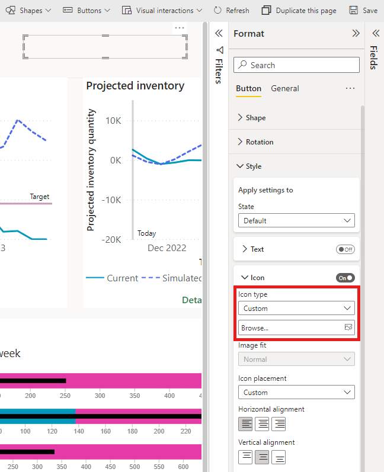

# Supply & demand insights overview

The Supply & demand insights home page in Microsoft Supply Chain Center presents a dashboard that shows five key performance indicators (KPIs) for inbound orders (procurement). The dashboard helps you monitor the general health of your inbound supply chain, identifies potential risks, and monitors performance. You can also create a personalized view of these KPIs through the My analytics feature. Just select **Create custom view** on the top bar in the **Supply and demand insights** module or **My analytics** in the left navigation pane.

> [!Video https://www.microsoft.com/videoplayer/embed/RE5azzg]

## SDI Landing Page
SDI landing page consists of favorite KPI’s and supply chain maps. The user can choose any three KPI’s from the persona pages. The user can choose all three favorite KPI’s from one persona or from multiple persona pages. The user must click on the pin icon  on the top right corner of the KPI’s in the persona pages to add it as favorite KPI’s on the landing page.

## Available KPIs

The **On time in full** (**OTIF**) and **Commitment shortage** KPIs measure the performance of vendors (suppliers), and the general trend of their performance is visualized in the line chart. **OTIF** shows how often the suppliers are delivering the purchase orders in full and on time as requested.

The **Supply coverage** and **Inventory turnover rate** (**ITR**) KPIs focus primarily on inventory levels at a facility or across facilities, to help you balance demand and inventory.

The **Projected inventory** KPI is an aggregated view of supply and demand across all facilities and items, and the general trend that's projected for on-hand stock over demand.

The visualizations on the landing page are aggregations of data across multiple facilities and items by all suppliers.

You can set target rates or goals for **OTIF**, **Commitment shortage**, **Supply coverage**, and **ITR**. The target settings let users benchmark or measure performance against set goals. You can also set the refresh frequency for the analytics of the **Supply and demand insights** module. In this way, you can ensure that you're accurately measuring your performance. You can find both settings in the Admin center. The following video provides more information.

> [!Video https://www.microsoft.com/videoplayer/embed/RE5cauF]

Every KPI has its own visualized report. Filters near the top of each report page can help you better understand the related KPI, because the report is updated based on the filters that you apply.

### On time in full

**OTIF** is a measure of a supplier's ability to fulfill an order in full and deliver it on time, based on the original requested delivery date. It's a key supply chain metric that's used to measure a supplier's performance. It's sometimes referred to as **Perfect Order**.

**OTIF** is expressed as a percentage. The following formula is used:

OTIF = (_All order lines delivered in full and on time in a month_ &divide; _All order lines for that month_) &times; 100

To determine whether an order is fulfilled in full, the system compares the purchase order quantity against the line item (Purchase Order Line table) with the quantity of all shipments that are in transit and the quantity that has been received against that line item of the purchase order.

To determine whether an order was delivered on time, the system compares the **Date Required** attribute of a Purchase Order Line entity or table with either the **EstimatedDeliveryTimestamp** attribute for shipments that are in transit or the **ShipmentDeliveryTimestamp** attribute for shipments that have been delivered. If either of those dates is beyond the value of the **Date Required** attribute, the order wasn't delivered on time.

A higher **OTIF** value indicates better performance. Target levels above 90 percent are considered preferred in the current competitive market demands.

#### Required entities

To enable **OTIF**, the following entities or tables are required:

- Item
- Vendors
- Warehouse
- Purchase Order
- Purchase Order Line
- Shipment
- Shipment Item
- Inventory Transaction
- Inventory Transaction Shipment
- Inventory Transaction Unserialized Item

> [!Video https://www.microsoft.com/videoplayer/embed/RE5cl3l]

### Inventory turnover rate

**ITR** is a measure of the number of times that goods have turned over relative to their consumption. In other words, it's a measure, by the company, of the number of days that are required to consume an item that was procured. **ITR** is indicative of the financial investment health of a company.

**ITR** is calculated as the ratio of goods that were consumed during one month to the average inventory for that month. The following formula is used:

ITR = _Goods sold or consumed in a month_ &divide; _Average inventory for the month_

Consumption of an item during each month is determined from Inventory Transaction entities. Average inventory during each month is determined from the Warehouse Item Available Stock entity.

A higher **ITR** value indicates better inventory management. In general, an **ITR** value above 2 is recommended.

#### Required entities

To enable **ITR**, the following entities are required:

- Item
- Vendors
- Warehouse
- Purchase Order
- Purchase Order Line
- Shipment
- Shipment Item
- Inventory Transaction
- Inventory Transaction Shipment
- Inventory Transaction Unserialized Item
- Warehouse Item Available Stock

> [!Video https://www.microsoft.com/videoplayer/embed/RE5cisx]

### Supply coverage

**Supply coverage** is a measure of supply that meets demand. It helps you determine whether the on-hand inventory and the expected supply that's in transit for a period will meet the demand for that period.

**Supply coverage** is calculated as the ratio of demand and supply, and is expressed as a percentage. The following formula is used:

Supply coverage = \[(_Sum of all supply for a period_) &divide; (_Sum of all demand for the period_)\] &times; 100

Supply consists of both on-hand inventory and inventory for shipments that are in transit. On-hand inventory is available in the Warehouse Item Available Stock entity. In-transit shipments are determined by using the Shipment and Shipment Item entities. Demand is available through the Build Plan entity, which holds the materials requirement planning for the item during the period.

A higher percentage indicates better supply coverage. A lower percentage indicates supply shortfalls and potential risks to meeting demand.

#### Open orders

The **Open orders** chart shows all purchase order lines that no shipment has yet been planned for. It includes partially fulfilled orders, backordered orders, and future orders that don't yet have planned shipments.

#### Shipments in transit

In-transit shipments are shipments that have been shipped by a supplier and are on their way to their final destination. The **Shipments in transit** report shows the original requested delivery date and the actual ship date, together with the original order quantity and the actual delivery quantity.

#### Required entities

To enable **Supply coverage**, the following entities are required:

- Build Plan
- Inventory Transaction
- Inventory Transaction Shipment
- Inventory Transaction Unserialized Item
- Item
- Item Unit Of Measure Conversion
- Location
- Purchase Order
- Purchase Order Line
- Shipment
- Shipment Item
- Shipment Location
- Shipment Route Leg
- Shipment Route Leg Equipment
- Shipment Route Leg Equipment Shipment Item
- Shipment Route Leg IOT
- Vendor
- Vendor Item Leadtime
- Vendor Item Status
- Vendor Location
- Warehouse Item Available Stock

> [!Video https://www.microsoft.com/videoplayer/embed/RE5cnB0]

### Commitment shortage

**Commitment shortage** is a measure of a supplier's forecasted commitments and its ability to meet those commitments. It's an important KPI that's used to evaluate a supplier's commitments.

**Commitment shortage** is the ratio of the supplier's forecast that's shared in weekly or daily buckets to the shipments that are received for that period. It's calculated by comparing the original promise and the actual delivery, and is expressed as a percentage. The following formula is used:

Commitment shortage = (_Quantity not delivered by the supplier for a period_ &divide; _Commitment quantity by the supplier for the period_) &times; 100

The supplier's commitment quantity for the period is derived from the ItemCustomerSupplyPlan table.

A low percentage indicates reliable performance (better commitment by the supplier), and a high percentage indicates a potentially unreliable supplier.

#### Required entities

To enable **Commitment shortage**, the following entities are required:

- Item
- Vendors
- Warehouse
- Purchase Order
- Purchase Order Line
- Shipment
- Shipment Item
- Inventory Transaction
- Inventory Transaction Shipment
- Item Customer Supply Plan
- Vendor Location
- Location
- Inventory Transaction Unserialized Item

> [!Video https://www.microsoft.com/en-us/videoplayer/embed/RE5cqYQ]

### Projected inventory

**Projected inventory** is the quantity of an item that's a shortfall or surplus for the on-hand demand. It's calculated as the difference between supply and firm demand. The following formula is used:

Projected inventory = _On-hand inventory_ + _In-transit shipments_ – _Firm demand_

Supply consists of both what's available on hand and what's expected to be received (in-transit shipments). 

#### Required entities

To enable **Projected inventory**, the following entities or tables are required:

- Item
- Vendors
- Warehouse
- Purchase Order
- Purchase Order Line
- Shipment
- Shipment Item
- Build Plan

> [!Video https://www.microsoft.com/videoplayer/embed/RE5cisz]

## Restock recommendations

Supply Chain Center has AI-driven optimal inventory. You can access it by selecting the **Restock recommendations** tab at the top of the page, as shown in the following illustration.

The **Restock recommendations** tab shows the reorder quantity by facility and item. It also shows the recommended safety stock for the combination of a facility and an item. You can download this recommendation as an Excel file. For more information, see [Configure and review restock recommendations](restock-recommendations.md).

## Downloading reports

You can download individual charts as an Excel file by selecting the **More options** button (three dots) in the upper-right corner of a given report and then selecting **Export data** on the menu. The menu also includes options that let you sort the report in different ways. For example, to sort the report by a specific column, select **Sort by** to get additional sort options.

## My analytics

You can use the **My analytics** feature to customize the out-of-box KPIs in the **Supply and demand insights** module. For example, you can change a line chart to a bar chart, completely remove an out-of-box chart, or make other edits to meet your company's needs. Changes that you make to the out-of-box KPIs are saved on the **My analytics** page. They don't overwrite your KPIs in the **Supply and Demand insights** module.

### Edit reports

Your reports appear as tabs at the bottom of the **My analytics** page. To switch reports, select a different tab.

To create a new report from scratch, select the plus sign (**+**) button to the right of the tabs.

> [!NOTE]
> Supply Chain Center doesn't currently support all Power BI capabilities for new reports.

Initially, the set of tabs corresponds to the different pages in the **Supply and demand insights** module, and each tab contains the same information. Each of these reports is a copy of what's in the **Supply and demand insights** module. Changes that you make to the reports on the **My analytics** page don't affect the reports in the **Supply and demand insights** module.

> [!IMPORTANT]
> Changes that you make on the **My analytics** page are permanent and can't be automatically reverted to their original visuals. However, the reports in the **Supply and demand insights** module will remain unchanged. Therefore, you can use them as a reference if you want to reset the reports on the **My analytics** page.

#### Add and edit charts

You can use the following expandable/collapsible panes on the right side of the **My analytics** page to edit the reports:

- **Filters** – Use this pane to change or modify filters. The filtering capability is driven by the data that's available in the data model that the out-of-box KPIs are built on.
- **Visualizations** – Use this pane to change the type of chart that's used. For example, you can change a line chart to a pie chart.
- **Fields** – This pane contains data models that visualization can be built on. These models come from the entities for the out-of-box KPIs, and from calculations that involve those entities.

To learn how fields, visualizations, and filters work together to create a chart, see [Build reports](/power-bi/fundamentals/desktop-getting-started#build-reports). For more information about filters and visualizations specifically, see [Take a tour of the report Filters pane](/power-bi/consumer/end-user-report-filter) and [Visualization types in Power BI](/power-bi/visuals/power-bi-visualization-types-for-reports-and-q-and-a).

> [!NOTE]
> The **My analytics** feature doesn't support user-specific changes. Edits that are made to the reports on the **My analytics** page are available to all users in your Supply Chain Center environment.

#### Remove charts or export the underlying data

To remove a chart from a report, select the **More options** button (three dots) in the upper-right corner of the chart, and then select **Remove** on the menu.

To download the raw data that powers a chart, select the **More options** button in the upper-right corner of the chart, and then select **Export data**.

### Personalize your report

You can personalize your report by adding text, shapes, and buttons. Just select **Text box**, **Shapes**, or **Buttons** on the toolbar at the top of the **My analytics** page, and then select an option on the menu.

Buttons can also be used to add images, as described in the following procedure.

1. Select **Buttons** on the toolbar, and then select **Blank** on the menu.

    
 
2. While the new button is selected, in the **Format** pane on the right, under **Style**, set the **Icon** option to **On**. Then change the icon type to **Custom**, and select **Browse** to upload an image.

    
 
    In the example in the following illustration, the Microsoft logo has been uploaded.

    

3. Adjust the size and position of the uploaded image until you're satisfied with the result.
