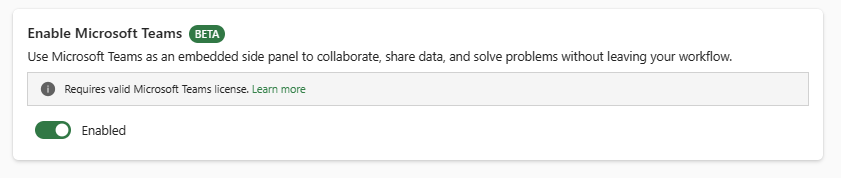
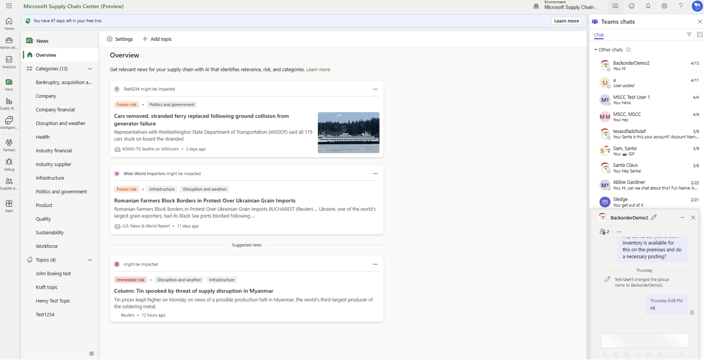
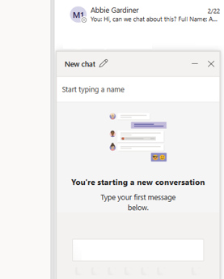

# Microsoft Teams Integration

The Microsoft Supply chain center integration with Microsoft Teams allows you to create and access Teams chats directly within the application. This integration lets you communicate with your colleagues while maintaining context within the application.

## Enable Teams

The Teams integration can be enabled via the **Admin settings** in Supply Chain Center. 

To access the **Admin settings**, follow these steps.

1. From Supply Chain Center, select the gear symbol in the upper right corner, and then select **Admin settings**. 
1. On the **Admin settings** page, select **General**, and then **Enable** to enable Teams. 

 

## Access Teams chat in Supply Chain Center

Once Teams has been enabled, chat can be accessed from any screen by selecting the chat icon on the Supply Chain Center title pane.

To access Teams chat in Supply Chain Center, follow these steps.

1. From the title pane, select the chat icon. Teams will display the list of recent teams chats for the logged-in user. 
1. Select any chat to launch a chat window. At the bottom of the screen, you can see the latest messages and send a new message. 

To hide the chat window, select the chat icon again.

 

## Start a new chat in Supply Chain Center

To start a new chat in Supply Chain Center, from the **Teams chats Pane** select the **Compose Chat** icon in the upper-right corner. This action will generate a new chat option at the bottom of the page where you can start a new individual or group chat.

 
