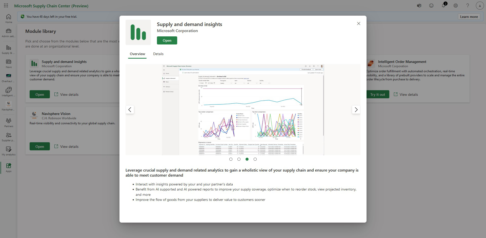

# Microsoft Teams Integration

Communication plays a crucial role in modern supply chains enabling different departments and teams to collaborate 
effectively and efficiently towards achieving common goals. The Microsoft Supply chain center integration with Microsoft Teams 
allows users to create and access teams chats directly within the application allowing them to communicate with their colleagues 
while maintaining context within the application at all times.

## Enable Microsoft Teams

The Microsoft Teams integration can be enabled via the Admin settings in Supply Chain Center. To access the admin settings, 
select the gear symbol in the upper right corner and then select Admin settings. In Admin settings, 
click on General to access the setting to enable Microsoft Teams. 

## Access Microsoft Teams in Supply Chain Center

Once Microsoft Teams has been enabled, the integration can be accessed from any screen in Supply chain center via the chat icon on the Supply Chain Center header bar. 
Click on the chat icon    to launch Teams. Teams will display the list of recent teams chats for the logged-in user. 
Click on any chat to launch a chat window at the bottom of the screen where you can see the latest messages as well as send a new message. 
To hide the chat window, click on the chat icon once more.

## Start a new chat in Supply Chain Center

Select the Compose Chat icon    in the upper-right corner of the Teams Chats pane. This will generate a new chat option 
at the bottom of the page where the user can start a new individual or group chat.

On the **Module library** page, you can view a list of all available modules, learn more about each module, and enable/disable selected modules.

