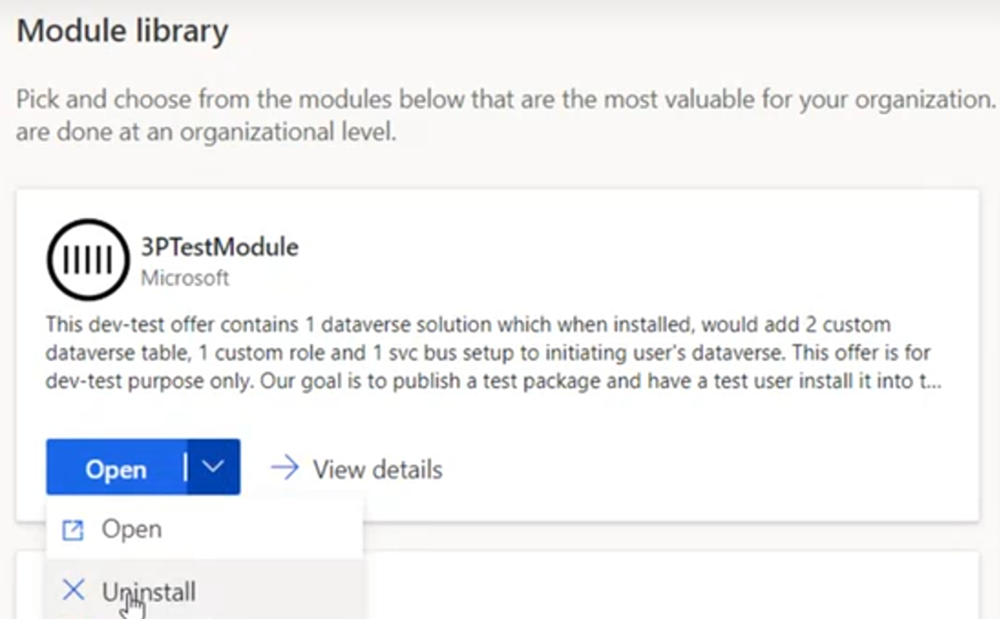

# Uninstall an ISV module

This article describes how to uninstall an ISV module from your Microsoft Supply Chain Center dashboard.

>[!Note]
> Uninstalling an ISV module within the Supply Chain Center _does not_ cancel your subscription or license with that provider. If you wish to cancel your license, you will need to contact the provider directly.

To uninstall an ISV module, complete the following procedure.

1. From the **Module library** , locate the ISV module you want to uninstall.
2. Select the downward arrow next to the **Open** button, and then select **Uninstall**.

3. Select **Uninstall** to confirm removal. You are redirected to the **Marker portal**.
4. Select the solution that is tied to the module you'd like to uninstall, and then select **Delete**.

5. After the delete process is complete, your module will be removed and reset within the Module Library.

To validate the module was uninstalled successfully, from the navigation pane, select the **Module Library.** If the module was uninstalled successfully, **Add** displays (instead of **Open** ).
