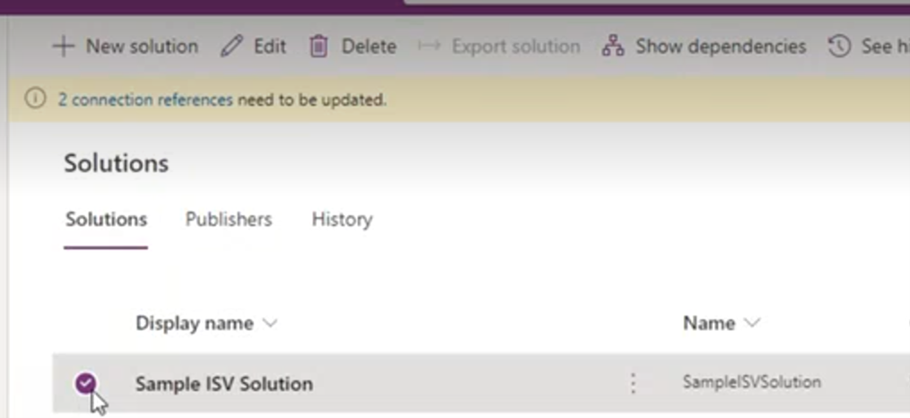

# Uninstall an ISV module

This article describes how to uninstall an independent software vendor (ISV) module from your Microsoft Supply Chain Center dashboard.

> [!Note]
> Uninstalling an ISV module in Supply Chain Center does **not** cancel your subscription or license with the provider. If you want to cancel your license, you must contact the provider directly.

To uninstall an ISV module, follow these steps.

1. In the Module library, find the ISV module that you want to uninstall.
2. Select the drop-down arrow next to the **Open** button, and then select **Uninstall** on the menu.

    

3. Select **Uninstall** to confirm removal. You're redirected to the Maker portal.
4. Select the solution that's linked to the module that you want to uninstall.

    

5. Select **Delete**.

When the deletion process is completed, the module will be removed and reset in the Module Library.

To validate that the module was successfully uninstalled, select **Module Library** in the navigation pane. If the module was successfully uninstalled, the **Add** button is shown instead of the **Open** button.
